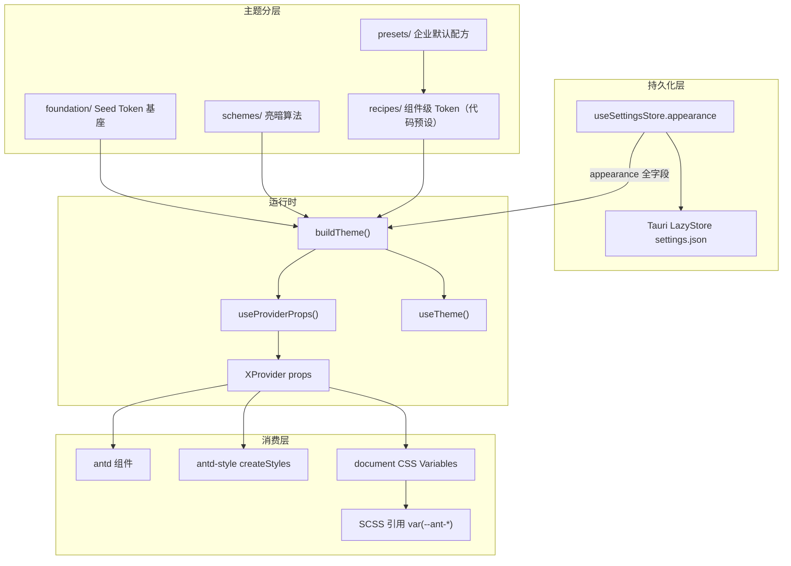

# 企业级 Ant Design 动态主题架构方案

## 现状诊断

| 模块                                                      | 现状                                                                | 问题                          |
| --------------------------------------------------------- | ------------------------------------------------------------------- | ----------------------------- |
| [`App.tsx`](apps/client/src/App.tsx)                      | 硬编码 `themeConfigure` 传给 `XProvider`                            | 无法动态切换                  |
| [`stores/setting.ts`](apps/client/src/stores/setting.ts)  | 当前仅 `theme` / `color`；需扩展 density/radius/fontSize/components | **未被引用**                  |
| [`themes/`](apps/client/src/themes/)                      | `color.ts` 有工具函数；`foundation`/`recipes` 空文件                | 架构骨架未落地                |
| [`variables.scss`](apps/client/src/styles/variables.scss) | `--vt-c-*` / `--color-*` 双轨色板 + `prefers-color-scheme`          | 与 antd 主题冲突，本期移除    |
| 组件层                                                    | 部分用 `theme.useToken()`、`createStyles`                           | 正确方向，但缺统一 Token 来源 |

技术栈：**antd ^6.5.0**、**antd-style ^4.1.0**、**@ant-design/x ^2.8.0**（`XProvider` 完全继承 `ConfigProvider`，根 Provider 保持 `XProvider` 即可）。

---

## 目标架构（四层 + 运行时）



### 分层职责（企业最佳实践）

**1. Foundation（设计基座）** — [`themes/foundation/`](apps/client/src/themes/foundation/)

只放 **Seed Token** 与品牌色板，不直接写组件样式：

- `palette.ts`：品牌色常量、`@ant-design/colors` 的 `generate()` 派生 10 阶色
- `foundation.ts`：全局 Seed（`colorPrimary`、`borderRadius`、`fontSize`、`sizeUnit`、`wireframe`、`motion` 等）
- 复用现有 [`color.ts`](apps/client/src/themes/color.ts) 做 hex/rgba 解析与混色

**2. Schemes（主题方案）** — [`themes/schemes/`](apps/client/src/themes/schemes/)

按 **模式** 组织，不负责组件细节：

- `light.ts` / `dark.ts`：导出 `LIGHT_ALGORITHM` / `DARK_ALGORITHM`
- `compact.ts`：导出 `COMPACT_ALGORITHM`
- `schemes.ts`：`parseScheme(theme, density)` 返回 algorithm 数组（`density: 'default' | 'compact'` 时叠加 compact）

**3. Recipes（组件配方）** — [`themes/recipes/`](apps/client/src/themes/recipes/)

按 **业务域** 拆分 component token：

- `layout.ts`：Layout / Menu / Sider（迁移 App.tsx 配置；暗色模式下优先 `algorithm: true` 派生，避免黑底黑字）
- `form.ts`：Button / Input / Select
- `feedback.ts`：Modal / Message / Notification
- `recipes.ts`：`mergeComponents(...)` 深合并

**4. Runtime（运行时合成）** — [`themes/runtime/`](apps/client/src/themes/runtime/)

- `build.ts`：唯一合成入口，导出 `buildTheme`

```typescript
// 伪代码 — 合成顺序（入参为 themes/appearance 的 Appearance，非 Setting 命名空间）
function buildTheme(appearance: Appearance): ThemeConfig {
  const resolvedTheme = appearance.theme === 'system' ? parseSystemTheme() : appearance.theme
  const token = mergeSeed(FOUNDATION, {
    color: appearance.color,
    radius: appearance.radius,
    fontSize: appearance.fontSize
  })
  const algorithm = parseScheme(resolvedTheme, appearance.density)
  const components = mergeComponents(RECIPES, appearance.components)
  return {
    cssVar: { key: CSS_VAR_KEY },
    hashed: true,
    algorithm,
    token,
    components
  }
}
```

- `theme.ts`：导出 `useTheme()`、`useProviderProps()`（含 `system` 的 `matchMedia` 订阅）
- `io.ts`：导出 `parseAppearance` / `stringifyAppearance` / `parseRecipePatch`（Zod + RECIPE_FIELDS 白名单）
- `index.ts`：对外导出 `buildTheme`、`useTheme`、`useProviderProps`、`PRESET`、`APPEARANCE_PRESET`、`CSS_VAR_KEY`

**5. Provider 接入** — [`App.tsx`](apps/client/src/App.tsx)

- 移除内联 `themeConfigure`（存量命名，不沿用）
- `const provider = useProviderProps()` 解构传给根 `XProvider`（`theme` + `componentSize` + `variant`）
- `useTheme()` 保留给仅需 `ThemeConfig` / token 的消费方
- App 启动时 `useSettingsStore.getState().initialize()`（与 mirror 初始化并列）
- **`loaded === false` 期间**：`useProviderProps` 使用 `APPEARANCE_PRESET`，避免异步加载前主题闪烁
- 嵌套 `XProvider`（如 intelligence overlay）仅覆盖局部 props，继承外层 `theme` / `componentSize` / `variant`

```typescript
const provider = useProviderProps()
<XProvider locale={zhCN} {...provider}>
```

---

## 持久化模型（扩展 Appearance）

### 类型单一来源 — 避免 `setting ↔ themes` 循环依赖

[`themes/appearance.ts`](apps/client/src/themes/appearance.ts) 定义应用域类型与默认值；**`buildTheme` / Zod / store 均引用此文件**，`presets/default.ts` 不再反向依赖 `Setting` 命名空间。

```typescript
// themes/appearance.ts
export type ThemeMode = 'light' | 'dark' | 'system'
export type ThemeDensity = 'default' | 'compact'

export interface Appearance {
  theme: ThemeMode
  color: string
  density: ThemeDensity
  radius: number
  fontSize: number
  size: ComponentSize
  variant: ComponentVariant
  components: ThemeComponent
}

export const APPEARANCE_PRESET: Appearance = {
  theme: 'system',
  color: PRIMARY_COLOR,
  density: 'default',
  radius: 6,
  fontSize: 14,
  size: 'middle',
  variant: 'outlined',
  components: {}
}
```

[`setting.ts`](apps/client/src/stores/setting.ts) 仅 re-export，不重复声明结构：

```typescript
import type { Appearance as ThemeAppearance } from '@/themes'
import { APPEARANCE_PRESET } from '@/themes'

declare namespace Setting {
  export type Appearance = ThemeAppearance
}

const SETTINGS: Setting.Composite = {
  general: { autostart: true, language: 'zh-CN' },
  appearance: APPEARANCE_PRESET
}
```

> **不做旧版 settings.json 迁移**：项目起步阶段无正式用户数据；`initialize` 合并默认值即可。

`useProviderProps()` 合成逻辑（含 system 解析与 loaded 兜底）：

```typescript
function useProviderProps() {
  const loaded = useSettingsStore((s) => s.loaded)
  const appearance = useSettingsStore((s) => s.settings.appearance)
  const resolved = loaded ? appearance : APPEARANCE_PRESET
  useSystemTheme() // 订阅 matchMedia；theme==='system' 时 OS 切换触发本 hook 重渲染

  return {
    theme: buildTheme(resolved), // 内部对 system 调用 parseSystemTheme()
    componentSize: resolved.size,
    variant: resolved.variant
  }
}
```

`parseScheme` 接收已解析的 `'light' | 'dark'`（由 `buildTheme` 在 `theme === 'system'` 时先 `parseSystemTheme()`）。

边界划分：

| 层级     | 来源                             | 说明                                            |
| -------- | -------------------------------- | ----------------------------------------------- |
| 用户可配 | `appearance` 全字段              | LazyStore 持久化，`update('appearance', patch)` |
| 企业基线 | `PRESET`（FOUNDATION + RECIPES） | 代码预设，components 为空时生效                 |
| 重置     | `resetAppearance()`              | 恢复 `APPEARANCE_PRESET`，不调用全局 `reset()`  |

导入导出 JSON 结构（带版本便于迁移）：

```json
{
  "version": 1,
  "appearance": {
    "theme": "system",
    "color": "#4080ff",
    "density": "default",
    "radius": 6,
    "fontSize": 14,
    "size": "middle",
    "variant": "outlined",
    "components": { "Layout": { "headerBg": "#000000" } }
  }
}
```

---

## Settings 主题面板（完整版）

改造 [`features/applications/settings/overlay.tsx`](apps/client/src/features/applications/settings/overlay.tsx)，拆分子组件 `theme-panel.tsx`：

| 区块     | 控件                                                         | 映射                                                                  |
| -------- | ------------------------------------------------------------ | --------------------------------------------------------------------- |
| 外观模式 | Segmented：浅色 / 深色 / 跟随系统                            | `appearance.theme`                                                    |
| 品牌主色 | ColorPicker + `@ant-design/colors` presets                   | `appearance.color`                                                    |
| 密度     | Radio：默认 / 紧凑                                           | `appearance.density` → compact algorithm                              |
| 组件尺寸 | Segmented：`small` / `middle`（或 `medium`，等价） / `large` | `appearance.size` → `componentSize`                                   |
| 组件变体 | Segmented：`outlined` / `filled` / `borderless`              | `appearance.variant`（`PROVIDER_VARIANTS` 白名单，不含 `underlined`） |
| 圆角     | Slider + InputNumber（2–16px）                               | `appearance.radius`                                                   |
| 字号     | Slider + InputNumber（12–18px）                              | `appearance.fontSize`                                                 |
| 组件配方 | Tabs（Layout / Form / Feedback）+ 表单项编辑 Token           | `appearance.components`                                               |
| 实时预览 | Demo 区（Button / Input / Menu / Modal）                     | 即时反馈                                                              |
| 操作     | 重置 / 导出 JSON / 导入 JSON                                 | `resetAppearance` / `stringifyAppearance` / `parseAppearance`         |

**Recipes 可视化范围**（不暴露 71 组件全部 semantic parts）：

| Tab      | 可编辑 Token 示例                                                   |
| -------- | ------------------------------------------------------------------- |
| Layout   | `headerBg`、`bodyBg`、`itemBg`、`colorText`（Menu）                 |
| Form     | `algorithm`、`colorPrimary`（Button）、`activeBorderColor`（Input） |
| Feedback | `contentBg`、`headerBg`（Modal）                                    |

每个 Token 字段旁提供「恢复预设」按钮，单字段回退到 `RECIPES` 默认值。

UI 规范：沿用 [`customize.tsx`](apps/client/src/views/marketplace/customize/customize.tsx) ColorPicker 模式；遵循 ui-ux-pro-max 对比度与 hover 反馈。

导入导出实现（Tauri 环境优先）：

- **导出**：`stringifyAppearance` → Tauri `save` 对话框写入 `.json`
- **导入**：选择文件 → `parseAppearance` 校验 → `update('appearance', parsed)`
- **Web fallback**：`Blob` + `<a download>` / `<input type="file">`

---

## cssVar 唯一来源 + SCSS 清理

**启用 cssVar（antd v6 推荐）：**

```typescript
cssVar: {
  key: CSS_VAR_KEY
} // 'ith'
// 产出 --ith-color-primary、--ith-color-bg-container 等变量到 :root
```

**迁移策略：**

### 保留不动

`--application-global-*` 业务布局变量**全部保留原值**，本期尤其 **`--application-global-round: 12px` 不改为 `var(--ith-border-radius)`**：

```scss
:root {
  --application-global-row-gap: 30px;
  --application-global-col-gap: 30px;
  --application-global-round: 12px; /* 暂不接入 antd token */
  --application-global-text-size: 13px;
  --application-global-text-color: #000000;
  --application-global-overlay-round: 8px;
  --ant-modal-content-padding: 20px;
}
```

### 全部移除

从 [`variables.scss`](apps/client/src/styles/variables.scss) **删除**以下变量及其 `@media (prefers-color-scheme)` 块：

- `--vt-c-*`（white / black / divider / text 等）
- `--color-*`（background / border / heading / text 等）

### 引用方替换

存量引用改为 antd cssVar 或 `theme.useToken()`：

| 原变量                    | 替换                                                       |
| ------------------------- | ---------------------------------------------------------- |
| `var(--color-background)` | `var(--ith-color-bg-container)`                            |
| `var(--color-heading)`    | `var(--ith-color-text-heading)` 或 `var(--ith-color-text)` |
| `var(--color-text)`       | `var(--ith-color-text)`                                    |
| `var(--color-border)`     | `var(--ith-color-border)`                                  |

已知引用文件（Phase 4 扫描）：

- [`views/signin/signin.module.scss`](apps/client/src/views/signin/signin.module.scss) — `var(--color-background)` / `var(--color-heading)`
- [`components/tiptap-ui/color-text-button/color-text-button.scss`](apps/client/src/components/tiptap-ui/color-text-button/color-text-button.scss) — `--color-text-button-color` 为**组件局部变量**，非全局色板，**保留不动**
- 全仓 `rg "var\\(--color-|var\\(--vt-c-"` 清零（排除上述组件局部变量）

### 新代码规范

- 禁止新增 `--vt-c-*` / `--color-*`
- 禁止新增独立 `prefers-color-scheme` 色板
- 自定义 React 组件优先 `createStyles(({ token }) => ...)` 或 `var(--ith-*)`
- Tiptap 等非 antd 区域同步使用 `--ith-*`

---

## 与 v6 语义化的协作边界

| 场景                   | 手段                                               |
| ---------------------- | -------------------------------------------------- |
| 全局品牌色（用户可调） | `appearance.color` → mergeSeed                     |
| 亮/暗/系统（用户可调） | `appearance.theme` → parseScheme                   |
| 密度（用户可调）       | `appearance.density` → compact algorithm           |
| 组件尺寸（用户可调）   | `appearance.size` → XProvider.componentSize        |
| 组件变体（用户可调）   | `appearance.variant` → XProvider.variant           |
| 圆角/字号（用户可调）  | `appearance.radius` / `fontSize` → Seed Token      |
| 组件配方（用户可调）   | `appearance.components` 深合并 RECIPES             |
| 企业基线（代码预设）   | `PRESET` = FOUNDATION + RECIPES                    |
| 单页面/单实例精致调整  | 组件 `styles` / `classNames`（参考 semantic 文档） |
| 自定义 React 组件      | `antd-style` `createStyles` + `token`              |

Recipes 默认可视化字段由 `themes/recipes/meta.ts` 声明（label、类型、默认值），面板据此动态渲染，避免硬编码表单。

---

## 目录结构（最终态）

```
apps/client/src/themes/
  index.ts
  appearance.ts         # Appearance / ThemeMode / APPEARANCE_PRESET（类型单一来源）
  antd.ts               # ComponentSize / ComponentVariant / ThemeComponent 别名
  schema.ts             # AppearanceSchema + parseRecipePatch
  color.ts
  foundation/
    palette.ts
    foundation.ts
  schemes/
    light.ts
    dark.ts
    compact.ts
    schemes.ts          # parseScheme(resolvedTheme, density)
  recipes/
    layout.ts
    form.ts
    feedback.ts
    meta.ts
    recipes.ts
  runtime/
    build.ts
    theme.ts            # useTheme() + useProviderProps() + useSystemTheme()
    io.ts
  presets/
    default.ts          # PRESET（FOUNDATION + RECIPES）

apps/client/src/features/applications/settings/
  overlay.tsx
  theme-panel.tsx
  theme-preview.tsx
  theme-recipe-form.tsx
```

关键规则（对齐 [llms-semantic-cn.md](markdown/llms-semantic-cn.md) 与官方 v6 实践）：

- 组件级改色优先 `algorithm: true`，让 antd 从 Seed 派生 hover/active
- 禁止在业务代码直接使用 Seed Token（如 `colorBgBase`）
- 局部精致定制用 v6 语义化 `styles` / `classNames`，不新增全局 Token

---

## 命名规范（development-conventions）

实施时严格遵守 [development-conventions](.cursor/rules/development-conventions.mdc)，主题模块命名对照：

### 常量（全大写，不加 DEFAULT 前缀）

| 名称                                 | 位置                           | 含义                                                                       |
| ------------------------------------ | ------------------------------ | -------------------------------------------------------------------------- |
| `CSS_VAR_KEY`                        | `index.ts`                     | cssVar 命名空间 `'ith'`（i-thinking 缩写，产出 `--ith-*`）                 |
| `FOUNDATION`                         | `foundation/foundation.ts`     | 全局 Seed Token 基座                                                       |
| `RECIPES`                            | `recipes/recipes.ts`           | 组件级 Token 合集                                                          |
| `PRESET`                             | `presets/default.ts`           | 企业默认配方（FOUNDATION + RECIPES）                                       |
| `LIGHT_ALGORITHM` / `DARK_ALGORITHM` | `schemes/light.ts` / `dark.ts` | antd 亮/暗算法                                                             |
| `PRIMARY_COLOR`                      | `foundation/palette.ts`        | 品牌色 `'#4080ff'`                                                         |
| `APPEARANCE_PRESET`                  | `appearance.ts`                | store 与 hooks 默认值                                                      |
| `PROVIDER_VARIANTS`                  | `appearance.ts` 或 `antd.ts`   | ConfigProvider 全局 variant 白名单：`outlined` \| `filled` \| `borderless` |
| `COMPACT_ALGORITHM`                  | `schemes/compact.ts`           | 紧凑模式算法                                                               |
| `RECIPE_FIELDS`                      | `recipes/meta.ts`              | recipes 可视化字段元数据                                                   |

### 函数（`function` 声明，动词开头，禁止 get/resolve/set）

| 名称                  | 职责                                                    | 替代（禁止）                                |
| --------------------- | ------------------------------------------------------- | ------------------------------------------- |
| `buildTheme`          | 合成 `ThemeConfig`                                      | ~~buildThemeConfig~~                        |
| `parseScheme`         | 已解析 `'light' \| 'dark'` + `ThemeDensity` → algorithm | `system` 在调用前由 `parseSystemTheme` 处理 |
| `parseSystemTheme`    | `matchMedia` → `'light' \| 'dark'`                      | `useSystemTheme` hook 订阅变化              |
| `parseRecipePatch`    | 过滤 `components` 为 RECIPE_FIELDS 白名单               | 导入 JSON 防脏数据                          |
| `parseAppearance`     | 导入 JSON → `Appearance`                                | Zod + `parseRecipePatch`                    |
| `stringifyAppearance` | `Appearance` → JSON 字符串                              | ~~exportTheme~~                             |
| `mergeSeed`           | FOUNDATION + 用户 color/radius/fontSize                 | ~~mergeFoundation~~                         |
| `mergeComponents`     | RECIPES 与用户 components 深合并                        | ~~mergeRecipes~~                            |
| `useTheme`            | React hook，返回 `ThemeConfig`                          | 组件内 `theme.useToken()` 同源              |
| `useProviderProps`    | React hook，返回 `theme` + `componentSize` + `variant`  | App 根 XProvider                            |

### 类型

**原则：不重复定义 antd 已有类型；允许项目语义别名重导出。**

统一入口 [`themes/antd.ts`](apps/client/src/themes/antd.ts)（或 `themes/index.ts` 再导出）：

```typescript
import type { ThemeConfig } from 'antd'
import type { SizeType } from 'antd/es/config-provider/SizeContext'
import type { Variant } from 'antd/es/config-provider/context'

// 项目语义别名（重导出，不手写 union）
export type ComponentSize = SizeType
export type ComponentVariant = Variant
export type ThemeComponent = NonNullable<ThemeConfig['components']>
export type ThemeToken = NonNullable<ThemeConfig['token']>
```

| 类型               | 来源                                  | 说明                                               |
| ------------------ | ------------------------------------- | -------------------------------------------------- |
| `ThemeConfig`      | `antd`                                | 直接使用，不包装                                   |
| `SizeType`         | `antd/es/config-provider/SizeContext` | 组件尺寸；别名 `ComponentSize`                     |
| `Variant`          | `antd/es/config-provider/context`     | 组件变体；别名 `ComponentVariant`                  |
| `ThemeComponent`   | `ThemeConfig['components']` 派生      | recipes / appearance.components                    |
| `ThemeToken`       | `ThemeConfig['token']` 派生           | mergeSeed 入参/出参                                |
| `ThemeMode`        | `appearance.ts`                       | 应用域：亮/暗/系统                                 |
| `ThemeDensity`     | `appearance.ts`                       | 应用域：compact algorithm                          |
| `Appearance`       | `appearance.ts`                       | 持久化与 `buildTheme` 入参                         |
| `ComponentSize`    | `antd.ts` 别名 `SizeType`             | `medium` 与 `middle` 等价，UI 可展示其一           |
| `ComponentVariant` | `antd.ts` 别名 `Variant`              | 全局仅 `PROVIDER_VARIANTS` 子集                    |
| `RecipeField`      | `recipes/meta.ts`                     | 元数据                                             |
| `AppearanceSchema` | `schema.ts`                           | Zod；`components` 经 `parseRecipePatch` 白名单过滤 |

禁止写法：

```typescript
// ❌ 重复定义 antd 已有 union
type SizeType = 'small' | 'medium' | 'large'
type Variant = 'outlined' | 'filled'

// ✅ 从 antd 引入或别名
import type { SizeType } from 'antd/es/config-provider/SizeContext'
export type ComponentSize = SizeType
```

`setting.ts` 通过 `export type Appearance` re-export；**默认值 `appearance: APPEARANCE_PRESET`**，不在 store 硬编码第二份。

### 文件与导出

- 文件名 kebab-case 或与导出名一致：`build.ts` → `buildTheme`，`theme.ts` → `useTheme`
- 对外 API 统一从 `themes/index.ts` 导出，业务侧只 `import { useTheme, buildTheme } from '@/themes'`
- 非必要禁止箭头函数；`useTheme` 内部 `useEffect` 回调可用箭头

### App 层改写

```typescript
// Before
const themeConfigure: ThemeConfig = { ... }
<XProvider theme={themeConfigure}>

// After
const provider = useProviderProps()
<XProvider locale={zhCN} {...provider}>
```

---

## 实施阶段

**推荐顺序**：Phase 1 → Phase 2 → Phase 4（可与 2 并行）→ Phase 3 → Phase 5

### Phase 1 — 主题内核（无 UI）

- 实现 `appearance.ts`（类型 + `APPEARANCE_PRESET`）解耦循环依赖
- 实现 foundation / schemes（含 compact）/ recipes / meta / `buildTheme`
- 编写 `presets/default.ts` 导出 `PRESET`（FOUNDATION + RECIPES）
- 编写 `schema.ts` + `io.ts`（`parseAppearance` / `parseRecipePatch` / `stringifyAppearance`）
- 单元测试：`buildTheme` 覆盖 light/dark、density、token、components 合并

### Phase 2 — 运行时接入

- `setting.ts`：re-export `Appearance`，`appearance: APPEARANCE_PRESET`
- store 新增 `resetAppearance()`
- 实现 `useSystemTheme`（`matchMedia` 订阅）、`useTheme`、`useProviderProps`（**loaded 前用 `APPEARANCE_PRESET`**）
- 改造 `App.tsx`：`useProviderProps()` 注入 XProvider
- App 启动 `useSettingsStore.getState().initialize()`

### Phase 3 — Settings 主题面板

- `theme-panel.tsx`：模式 / 主色 / 密度 / 尺寸 / 变体（`PROVIDER_VARIANTS`）/ 圆角 / 字号
- `theme-recipe-form.tsx`：Layout / Form / Feedback Tabs，`RECIPE_FIELDS` 动态渲染
- `theme-preview.tsx`：实时预览区
- 导入导出 + 重置（Tauri dialog + Web fallback）

### Phase 4 — SCSS 清理（可与 Phase 2 并行）

- 启用 cssVar（`CSS_VAR_KEY = 'ith'`）
- `variables.scss`：删除 `--vt-c-*`、`--color-*`、`prefers-color-scheme`；保留 `--application-global-*`
- 替换 signin 等引用；**保留** tiptap `--color-text-button-color` 局部变量
- 验证亮/暗/系统下 `--ith-*` 与 antd 一致

### Phase 5 — 验收

- 亮/暗/系统（含 OS 切换）+ 密度 + size/variant 正确
- `loaded` 前无主题闪烁
- 暗色模式下 Layout/Menu recipes 可读性（对比度）
- 嵌套 `XProvider`（intelligence overlay）继承外层 theme
- 圆角/字号、recipes 编辑、单字段恢复、全局重置
- JSON 导入导出往返；`parseRecipePatch` 拒绝非法 components
- Tauri 重启持久化；`theme.useToken()` 同步

---

## 关键设计决策

| 决策             | 选择                                     | 理由                                                        |
| ---------------- | ---------------------------------------- | ----------------------------------------------------------- |
| 根 Provider      | 保持 XProvider                           | 项目已用 @ant-design/x，完全继承 ConfigProvider             |
| CSS 变量 key     | `'ith'`（常量 `CSS_VAR_KEY`）            | 比 `i-thinking` 短；产出 `--ith-color-primary` 等           |
| SCSS 色板        | 移除 `--vt-c-*` / `--color-*`            | 唯一色源为 `--ith-*`；`--application-global-*` 布局变量保留 |
| 组件 Token 组织  | recipes 按域拆分，编入 presets           | 企业可维护；与用户 store 解耦                               |
| 用户可编辑范围   | appearance 全字段 + recipes 可视化       | 密度/圆角/字号/组件/导入导出均纳入本期                      |
| Store 扩展       | re-export Appearance + resetAppearance   | 类型在 `appearance.ts`，无循环依赖                          |
| 旧数据迁移       | **不做**                                 | 项目起步阶段，initialize 合并默认值即可                     |
| SizeType         | `medium` ≡ `middle`                      | 沿用 antd `SizeType`，UI 展示其一即可                       |
| Provider variant | `PROVIDER_VARIANTS` 白名单               | 全局仅 outlined/filled/borderless                           |
| system 主题      | `useSystemTheme` + `matchMedia` 订阅     | OS 切换时实时更新                                           |
| 加载闪烁         | `loaded` 前 fallback `APPEARANCE_PRESET` | 避免首屏跳变                                                |
| components 校验  | `parseRecipePatch` + RECIPE_FIELDS       | 不用裸 `z.custom`                                           |
| Layout recipes   | 暗色优先 `algorithm: true`               | 避免黑底黑字                                                |
| 执行顺序         | 1→2→(4∥2)→3→5                            | 先打通链路再做 Settings 大面板                              |
| Recipes 元数据   | RECIPE_FIELDS 驱动表单                   | 可维护、可扩展，不硬编码 71 组件                            |
| 导入导出         | version 字段 + Zod 校验                  | 企业运维友好，防脏数据                                      |
| 命名规范         | 见上文「命名规范」专节                   | parse/build/merge 动词；常量全大写无 DEFAULT 前缀           |
| 类型策略         | 复用 antd 类型 + 语义别名                | 禁止重复 SizeType/Variant 等 union 定义                     |

---

## Planning Files（执行时创建）

按 planning-with-files 技能，实施前在项目根创建：

- `task_plan.md` — 跟踪上述 5 个 Phase
- `findings.md` — 记录 `--color-*` / `--vt-c-*` 引用清单与 `--ith-*` 映射
- `progress.md` — 每 Phase 测试结果
