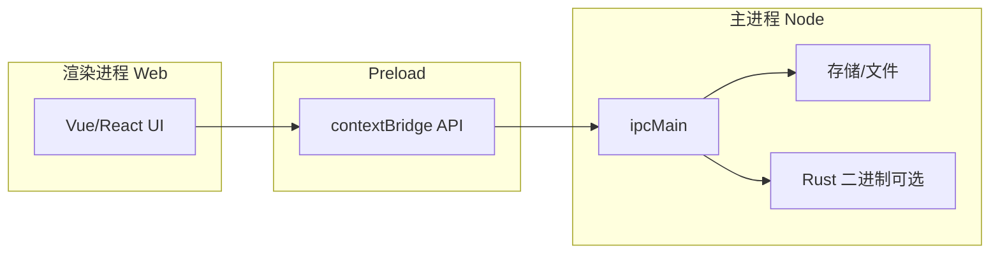

# Electron 40.1.0 开发计划

## 1. 参考 Tauri 2 明确开发边界：Web 与 Node

### Tauri 2 边界（当前 client 实践）

- **Web 侧（渲染进程）**：Vue/React 前端、仅通过 `@tauri-apps/api` 的 `invoke()` 调用后端；不直接访问文件系统、不执行 Rust。
- **Native 侧（Rust）**：`#[tauri::command]` 暴露命令（如 `greet`、`os`），插件如 `tauri-plugin-store`、`tauri-plugin-sql` 在 Rust 侧读写存储；前端通过插件封装好的 API（如 `Store.load()`、`Database.load()`）间接访问。

对应关系与建议：

| Tauri 2                            | Electron 40 对应                                                                               |
| ---------------------------------- | ---------------------------------------------------------------------------------------------- |
| 前端 invoke → Rust command         | 渲染进程 → preload → main 进程 IPC（`ipcRenderer.invoke` / `ipcMain.handle`）                  |
| contextIsolation + 不暴露完整 Node | 保持 `contextIsolation: true`，preload 仅通过 `contextBridge.exposeInMainWorld` 暴露白名单 API |
| 插件（store/sql/fs）在 Rust 侧     | 存储/文件在 **主进程** 用 Node 实现，通过 IPC 暴露给渲染进程                                   |

### 边界规则（与 Tauri 对齐）

- **渲染进程（Web）**：只跑前端代码、不 `require('node:fs')` 等；通过预定义 IPC channel 调用主进程能力。
- **主进程（Node）**：窗口、菜单、系统 API、**所有持久化与文件 I/O**；可调用 Rust 二进制或 Node 原生模块。
- **Preload**：唯一桥；只暴露约定好的方法（如 `window.electronAPI.storeGet(key)`），不暴露 `process`、`require`。

当前 [apps/studio/electron/preload.ts](apps/studio/electron/preload.ts) 已用 `contextBridge` 暴露 `ipcRenderer`，建议后续改为**按能力封装**（如 `store`、`dialog`、`fs`），避免把裸 `ipcRenderer` 暴露给渲染进程，与 Tauri 的「仅暴露声明过的 API」一致。

---

## 2. 高性能服务与 Rust 辅助

- **适合用 Rust 的场景**：加解密、编解码、大文件/流处理、CPU 密集计算、与现有 Tauri client 共享算法（同一 Rust crate）。
- **实现方式**：
  - **方式 A**：主进程用 `child_process.spawn` 调用独立 Rust 二进制（与 [apps/client/src-tauri](apps/client/src-tauri) 可共享代码或单独 binary）。
  - **方式 B**：主进程通过 **Node-API (N-API)** 使用 Rust 编译的 `.node` 原生模块（需 [@electron/rebuild](https://www.npmjs.com/package/@electron/rebuild) 或 electron-builder 的 rebuild 步骤）。
- **建议**：一般 I/O 与键值存储用 Node 即可；仅当性能瓶颈明确或需与 Tauri 共用逻辑时再引入 Rust，并优先用「独立进程 + IPC」以降低耦合。

---

## 3. electron-to-chromium 的作用与是否采用

**作用**：提供 **Electron 版本 → Chromium 版本** 的映射表，供 Browserslist/Autoprefixer/Babel/ESLint 等使用，以便：

- 按目标 Electron 的 Chromium 版本做 CSS 兼容（如 `autoprefixer`）、
- 做 JS 语法/API 兼容（如 `@babel/preset-env`）、
- 做 `eslint-plugin-compat` 等兼容性检查。

**Electron 40.1.0** 对应 **Chromium 144**。若希望构建与 Tauri 的 WebView 对齐，或需要「last 1 Electron version」这类 Browserslist 目标，就需要让工具链认识 Electron 版本。

**建议**：

- 在 [.browserslistrc](.browserslistrc) 中增加 Electron 目标，例如：  
  `Electron >= 40`  
  这样 Browserslist 会自动依赖 `electron-to-chromium`（或你显式安装 `electron-to-chromium`）解析为 Chromium 144。
- 若使用 **Vite**，在 `vite.config` 中设置 `build.target` 与 Browserslist 一致（或使用 `'electron40'` 等），以便打包出的代码适配 Electron 40 的 Chromium。
- **结论**：需要；通过 Browserslist 的 Electron 查询间接使用即可，无需在业务代码里直接引用。

---

## 4. @electron/rebuild 与 electron-builder 的区别与选型

| 维度       | @electron/rebuild                                                                                             | electron-builder                                                     |
| ---------- | ------------------------------------------------------------------------------------------------------------- | -------------------------------------------------------------------- |
| **职责**   | 仅针对当前 Electron 版本**重新编译原生 Node 模块**（.node）                                                   | **打包分发**：生成安装包（msi/dmg/deb 等）、应用结构、可选的 rebuild |
| **何时用** | 使用了 `node-gyp` 原生模块（如 `better-sqlite3`、`sharp`、自研 N-API）且与 Electron 的 Node 版本/ABI 不一致时 | 需要产出可安装的桌面应用时                                           |
| **关系**   | 可被 electron-builder 在打包前自动调用（`npmRebuild: true`）                                                  | 是「打包 + 可选 rebuild」的一体化方案                                |

**选型建议**：

- **打包桌面应用**：继续用 **electron-builder**（你已在 [apps/studio/package.json](apps/studio/package.json) 使用 `electron-builder`）。
- **是否要 @electron/rebuild**：
  - 若**没有**任何原生 Node 模块（纯 JS/TS + 内置 Node API）→ **不需要**单独安装。
  - 若**有**原生模块（如 SQLite 绑定、Rust .node）→ 在 `electron-builder` 配置中开启 `npmRebuild: true`（默认通常为 true），或单独在 `postinstall` 里执行 `electron-rebuild`（即 @electron/rebuild），二选一即可；一般用 electron-builder 自带的 rebuild 即可。

---

## 5. @electron/packager 与 electron-chromedriver 的作用

### @electron/packager

- **作用**：把「源码 + Electron 运行时」打成**各平台可执行目录**（如 `out/i-thinking-win32-x64`），**不负责**安装包（不生成 msi/dmg）。
- **与 electron-builder 关系**：electron-builder 内部可用 packager 做「先打包成目录，再打成安装包」；若你只用 electron-builder 且满足需求，**无需单独使用** @electron/packager。
- **何时单独用**：只要文件夹形式的绿色版、不需要安装程序时，可直接用 `@electron/packager`。

### electron-chromedriver

- **作用**：提供与 **Electron 版本匹配的 ChromeDriver**，用于 **WebDriver 自动化测试**（E2E），例如 Selenium/WebDriverIO 驱动 Electron 窗口。
- **何时需要**：做 **Electron 的 E2E 自动化**（类似 Tauri 的 WebDriver 测试）时需要；与「日常开发、打包」无关。
- **结论**：仅在做 Electron E2E 测试时安装；若当前 E2E 用 Playwright 且不依赖 WebDriver，可不引入。

---

## 6. 参考 Tauri 插件的 Electron 存储方案

### Tauri 侧当前用法（对应关系）

| Tauri 能力             | 用途                                                                                        | Electron 侧建议                                                                                                |
| ---------------------- | ------------------------------------------------------------------------------------------- | -------------------------------------------------------------------------------------------------------------- |
| **tauri-plugin-store** | 键值配置（如 [keycodes/store.ts](apps/client/src/keycodes/store.ts) 的 `keycode.json`）     | **electron-store** 或 **conf**（主进程 JSON 持久化，经 IPC 暴露）                                              |
| **tauri-plugin-sql**   | 关系型数据（[databases/client.ts](apps/client/src/databases/client.ts) 的 `i-thinking.db`） | 主进程 **better-sqlite3** 或 **sql.js**，通过 IPC 暴露查询接口；或使用 **RxDB + SQLite** 若需与 Web 端结构一致 |

### 推荐存储选型

- **简单键值 / 配置（对应 Tauri store）**
  - **electron-store**（推荐）：JSON、支持 main/renderer（若 renderer 用需经 preload 封装）、路径规范（app.getPath('userData')）。
  - 与 Tauri 的 `Store.load()` + `get/set/save` 语义接近，便于抽象一层「存储适配器」兼容 Tauri/Electron。
- **关系型 / 结构化（对应 Tauri plugin-sql）**
  - **better-sqlite3**（主进程）：性能好、同步 API，需原生编译（配合 electron-builder 的 rebuild）。
  - **sql.js**：纯 WASM，无原生模块，适合希望避免 rebuild 的场景，性能略逊。
  - 数据文件路径：`app.getPath('userData')` 下，例如 `userData/databases/i-thinking.db`。
- **不推荐**：在渲染进程直接用 IndexedDB/LocalStorage 做「唯一数据源」做大量结构化存储（多窗口同步与性能不如主进程 SQLite）；可作缓存或离线缓存。

### 架构建议

- 在**主进程**统一实现「store」与「database」模块，通过 **IPC handler**（如 `store:get`、`store:set`、`db:query`）暴露。
- 前端封装一层与 Tauri 类似的 API（如 `getKey(key)`、`setKey(key, value)`、`db.select(sql, params)`），便于 [apps/client](apps/client) 与 Electron 版共用同一套前端存储接口，仅底层实现不同（Tauri invoke vs IPC）。

---

## 实施清单（建议顺序）

1. **边界与安全**：将 studio 的 preload 改为按能力封装 API（store、dialog、fs 等），关闭不必要的 `nodeIntegration`（当前 [main.ts](apps/studio/electron/main.ts) 为 `nodeIntegration: true`，建议改为 false，所有 Node 能力经 preload 白名单暴露）。
2. **Browserslist**：在 .browserslistrc 增加 `Electron >= 40`，确认 Vite/build 目标与 Electron 40（Chromium 144）一致。
3. **Electron 版本**：将 [pnpm-workspace.yaml](pnpm-workspace.yaml) catalog 中 `electron: ^40.1.0` 锁定到 40.1.0（或保持 ^40.1.0），并确认 studio 使用该版本。
4. **打包**：继续使用 **electron-builder**；若引入原生模块，确保 `npmRebuild: true`（或按需在 postinstall 使用 @electron/rebuild）。
5. **存储**：主进程接入 **electron-store**（对应 Tauri store）+ **better-sqlite3 或 sql.js**（对应 Tauri sql），通过 IPC 暴露；前端做一层与 Tauri 兼容的适配 API。
6. **Rust**：仅在有明确性能需求或与 Tauri 共享逻辑时再引入；优先「独立可执行文件 + 主进程 spawn」。
7. **E2E**：若采用 WebDriver 方案再引入 **electron-chromedriver**；否则可继续用 Playwright 等现有方案。

按上述执行后，Electron 40.1.0 的边界、工具链与存储将与 Tauri 2 对齐，并保持可维护性与扩展空间。
