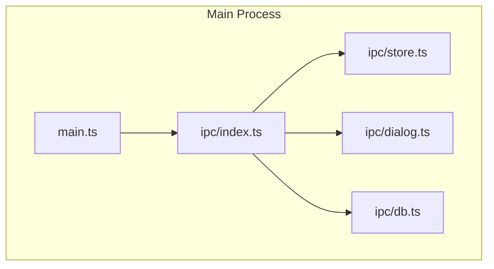

# Prisma、IPC 模块化与 Electron 最新 Chromium 配置计划

## 1. 配置 Prisma + better-sqlite3

### 依赖与移除

- **安装**（[apps/studio/package.json](apps/studio/package.json)）
  - `prisma`（devDependencies）
  - `@prisma/client`、`@prisma/adapter-better-sqlite3`、`better-sqlite3`（dependencies）
- **移除**：`sql.js`（由 Prisma + better-sqlite3 替代）

### Prisma 工程结构

- 在 `apps/studio/prisma/` 下新增：
  - `schema.prisma`：`provider = "sqlite"`，`generator client` 的 `output` 指向 `../src/generated/prisma`（或 `../generated/prisma`，与 tsconfig 一致）
- 数据库文件路径：主进程内使用 `app.getPath('userData')`，例如 `userData/databases/i-thinking.db`，与当前 [main.ts](apps/studio/electron/main.ts) 中 sql.js 路径一致。

### 主进程侧用法

- 在**主进程**（或后续拆出的 db IPC 模块内）：
  - 使用 `import Database from 'better-sqlite3'` 创建实例，路径为 `path.join(app.getPath('userData'), 'databases', 'i-thinking.db')`。
  - 使用 `@prisma/adapter-better-sqlite3` 的 adapter 包装该 Database 实例，再 `new PrismaClient({ adapter })`。
- **IPC 契约**：保持现有 `db:query`、`db:execute`、`db:close`，实现改为 `prisma.$queryRaw` / `prisma.$executeRaw`（或 Prisma 5 adapter 的等价用法），这样 [preload](apps/studio/electron/preload.ts) 与 [src/adapters/electron-storage.ts](apps/studio/src/adapters/electron-storage.ts) 无需改接口。
- **脚本**：在 `package.json` 增加 `"postinstall": "prisma generate"`（或 `"prisma generate"` 仅在 studio 下执行），保证安装后生成 Prisma Client。
- **打包**：保持 [electron-builder.json5](apps/studio/electron-builder.json5) 中 `npmRebuild: true`，以便 better-sqlite3 针对 Electron 正确编译。

### 可选：Prisma 7

- 若采用 Prisma 7，需 `provider = "prisma-client"` 且 `output` 必填；数据库 URL 可放在 `prisma.config.ts` 或运行时通过 adapter 传入 path。当前计划以 Prisma 5/6 的 `provider = "prisma-client-js"` + adapter 方式为主，迁移到 7 时仅调整 generator 与配置文件。

---

## 2. IPC 模块化（参考 Tauri 按功能/插件划分）

### 目标结构（与 Tauri 的 plugin 对应）

Tauri 侧在 [bootstrap.rs](apps/client/src-tauri/src/utils/bootstrap.rs) 中按插件注册（如 `tauri_plugin_store`、`tauri_plugin_dialog`、`tauri_plugin_sql`），Electron 侧按“功能模块”拆 IPC 注册，便于维护与扩展。

### 目录与职责

- **electron/ipc/store.ts**
  - 接收 `ipcMain` 与 electron-store 实例（或在该模块内创建 Store）。
  - 注册 `store:get`、`store:set`、`store:has`、`store:delete`、`store:clear`、`store:keys`。
  - 导出 `registerStoreIpc(ipcMain: Electron.IpcMain): void`（或接收 store 的工厂）。
- **electron/ipc/dialog.ts**
  - 接收 `ipcMain` 与“当前窗口”的获取方式（如 `() => BrowserWindow.getFocusedWindow() ?? win`）。
  - 注册 `dialog:open`、`dialog:save`。
  - 导出 `registerDialogIpc(ipcMain, getWindow)`。
- **electron/ipc/db.ts**
  - 接收 `ipcMain`，内部创建 Prisma Client（better-sqlite3 + adapter，路径用 `app.getPath('userData')`）。
  - 注册 `db:query`、`db:execute`、`db:close`（实现用 `prisma.$queryRaw` / `$executeRaw`，保持与现有前端契约一致）。
  - 导出 `registerDbIpc(ipcMain)`。
- **electron/ipc/index.ts**
  - 统一导出 `registerAllIpc(options)`，其中 `options` 可包含 `getWindow` 等。
  - 内部依次调用 `registerStoreIpc`、`registerDialogIpc`、`registerDbIpc`。
- **electron/main.ts**
  - 仅保留：常量与 env、`createWindow`、`app` 生命周期、`app.whenReady().then(() => { registerAllIpc({ getWindow }); createWindow(); })`。
  - 所有 `ipcMain.handle` 从 main.ts 移出，改为由上述 ipc 模块注册。

### Preload

- **方案 A（推荐）**：保持单文件 [preload.ts](apps/studio/electron/preload.ts)，按 `store`、`dialog`、`app`、`db` 分组暴露，与现有 `window.electronAPI` 一致；channel 名称与主进程各模块约定一致即可。
- **方案 B**：拆成 `electron/preload/store.ts`、`dialog.ts`、`db.ts`、`app.ts`，在 `preload.ts` 中聚合后 `contextBridge.exposeInMainWorld('electronAPI', { store, dialog, app, db })`。
- 计划以方案 A 为主，后续若 preload 体积或维护成本上升再拆分为方案 B。

### 类型与窗口依赖

- `dialog` 和部分逻辑需要“当前窗口”；在 `main.ts` 中保留 `let win: BrowserWindow | null`，将 `getWindow: () => win`（或 `() => BrowserWindow.getFocusedWindow() ?? win`）通过 `registerAllIpc({ getWindow })` 传入 `dialog` 模块，避免在 ipc 模块内直接依赖 main 的全局变量。

---

## 3. Electron 使用最新 Chromium（每次构建）

### 关系说明

- Electron 内置的 Chromium 版本由 **Electron 版本** 决定，无法单独升级 Chromium。
- “每次构建都是最新”即：每次构建时使用**当前可用的最新 Electron 版本**（在选定大版本下）。

### 实现方式

- **catalog**（[pnpm-workspace.yaml](pnpm-workspace.yaml)）：保持 `electron: ^40.1.0`，这样 `pnpm install` 会解析到当前满足 `^40.1.0` 的最新 40.x（含最新 Chromium）。
- **构建前刷新**：在 [apps/studio/package.json](apps/studio/package.json) 的 `build` 脚本前增加一步，在 studio 目录下执行 `pnpm update electron`，使本次构建使用当前最新的 40.x。
  - 做法一：`"prebuild": "pnpm update electron"`，并让 `build` 依赖 prebuild（例如 `"build": "pnpm run prebuild && tsc && vite build && electron-builder"`），这样每次 `pnpm build` 都会先更新 electron。
  - 做法二：不修改 build，在 CI 或本地构建脚本中先执行 `pnpm update electron` 再 `pnpm build`，并在 README 或计划中说明。
- **推荐**：采用做法一，在 studio 的 `package.json` 中增加 `prebuild` 并在 `build` 中调用，确保“每次构建”都先拉取最新 Electron（从而最新 Chromium）。

### 可选：锁定大版本

- 若希望避免意外升级到 Electron 41+，可保持 `^40.1.0`（只收 40.x 的 minor/patch）。若希望始终最新大版本，可改为 `latest` 或 `*`，但需接受可能的破坏性变更。

---

## 4. 实施顺序建议

1. **Prisma + better-sqlite3**

- 添加依赖，移除 sql.js；新增 `prisma/schema.prisma` 与 Prisma Client 生成；在主进程（或后续的 ipc/db 模块）中初始化 Prisma（better-sqlite3 + adapter），路径使用 `app.getPath('userData')`。

1. **IPC 模块化**

- 新建 `electron/ipc/store.ts`、`dialog.ts`、`db.ts`、`index.ts`，将现有 main.ts 中的 handle 按功能迁入各模块；main.ts 在 `app.whenReady` 中调用 `registerAllIpc` 后再 `createWindow`；preload 保持单文件，channel 与模块一致。

1. **db 模块接 Prisma**

- 在 `ipc/db.ts` 中用 Prisma Client 实现 `db:query` / `db:execute` / `db:close`（如 `$queryRaw` / `$executeRaw`），并关闭时调用 `prisma.$disconnect`（若适用）。

1. **Electron 版本**

- 在 studio 的 `package.json` 增加 `prebuild` 与 build 中对 `prebuild` 的调用，确保每次构建前执行 `pnpm update electron`。

1. **验证**

- 运行 `pnpm dev` 与 `pnpm build`，确认 store/dialog/db 行为与现有一致，且打包后应用可正常使用；确认 `pnpm update electron` 后 Electron 版本（及 Chromium）已更新。

---

## 5. 涉及文件一览

| 操作 | 路径                                                                  |
| ---- | --------------------------------------------------------------------- |
| 新增 | `apps/studio/prisma/schema.prisma`                                    |
| 新增 | `apps/studio/electron/ipc/store.ts`、`dialog.ts`、`db.ts`、`index.ts` |
| 修改 | `apps/studio/package.json`（依赖、scripts、postinstall/prebuild）     |
| 修改 | `apps/studio/electron/main.ts`（移除 handle，调用 registerAllIpc）    |
| 保持 | `apps/studio/electron/preload.ts`（channel 名与模块一致即可）         |
| 保持 | `apps/studio/electron-builder.json5`（npmRebuild: true）              |
| 可选 | `apps/studio/prisma.config.ts`（若采用 Prisma 7）                     |

按上述顺序实施后，studio 将使用 Prisma + better-sqlite3、按功能拆分的 IPC 模块，以及每次构建前更新 Electron 以使用最新 Chromium。
