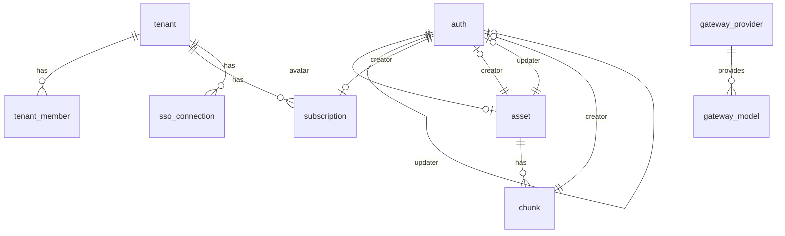
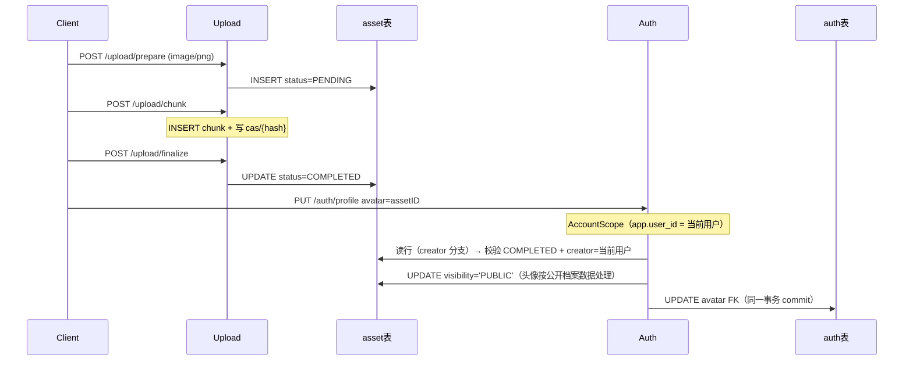

# 数据库表协作

PostgreSQL 业务表采用 **camelCase 列名**（Rust entity 字段仍为 snake_case，通过 `column_name` 映射）。

## ER 关系



| 关系                                               | 说明                                 |
| -------------------------------------------------- | ------------------------------------ |
| `auth.avatar` → `asset.id`                         | 用户头像，删除 asset 时 SET NULL     |
| `auth.creator/updater` → `auth.id`                 | 账号审计，自引用                     |
| `asset.creator/updater` → `auth.id`                | 上传/资源审计                        |
| `chunk.assetID` → `asset.id`                       | 分片归属，删除 asset 时 CASCADE      |
| `chunk.creator` → `auth.id`                        | 分片审计                             |
| `tenant_member.tenantID` → `tenant.id`             | 成员归属，删除租户时 CASCADE         |
| `tenant_member.userID` → `auth.id`                 | 成员用户，删除账号时 CASCADE         |
| `sso_connection.tenantID` → `tenant.id`            | OIDC 连接归属，删除租户时 CASCADE    |
| `gateway_model.providerID` → `gateway_provider.id` | 模型所属供应商，删除供应商时 CASCADE |
| `subscription.tenantID` → `tenant.id`              | 订阅归属，删除租户时 CASCADE         |
| `subscription.creator/updater` → `auth.id`         | 订阅审计                             |

## auth 表

Entity：[`entity/src/auth.rs`](../entity/src/auth.rs)

| 列 (DB)    | 类型        | 说明                           |
| ---------- | ----------- | ------------------------------ |
| id         | uuid PK     | 用户 ID                        |
| username   | text UNIQUE | 登录名                         |
| password   | text        | 加密后密码                     |
| email      | text        | 邮箱                           |
| phone      | text UNIQUE | 手机号（可 NULL，唯一）        |
| age        | int         | 年龄                           |
| gender     | text        | MALE / FEMALE                  |
| birthday   | date        | 生日                           |
| avatar     | uuid FK     | → asset.id                     |
| role       | text        | USER / ADMIN，默认 USER        |
| status     | text        | ACTIVE / DISABLED，默认 ACTIVE |
| archivedAt | timestamptz | 归档时间                       |
| createdAt  | timestamptz | 创建时间                       |
| creator    | uuid FK     | → auth.id                      |
| updatedAt  | timestamptz | 更新时间                       |
| updater    | uuid FK     | → auth.id                      |
| expiresAt  | timestamptz | 过期时间                       |

**使用模块**：auth（登录/profile）、user（后台 CRUD）

## asset 表

Entity：[`entity/src/asset.rs`](../entity/src/asset.rs)

| 列 (DB)                                                            | 类型    | 说明                                                            |
| ------------------------------------------------------------------ | ------- | --------------------------------------------------------------- |
| id                                                                 | uuid PK | 资源 ID                                                         |
| tenantID                                                           | text    | 租户 ID（可空）                                                 |
| kind                                                               | text    | 类型，上传为 `upload`                                           |
| hash                                                               | text    | 文件 SHA256（64 位 hex），索引；prepare 时可先空串              |
| sha                                                                | text    | finalize 校验后的整文件 SHA（与 hash 一致）                     |
| size                                                               | bigint  | 文件总字节                                                      |
| index                                                              | bigint  | 租户内列表排序（默认 0）；≠ chunk.index                         |
| mime                                                               | text    | MIME                                                            |
| extension                                                          | text    | 扩展名                                                          |
| name                                                               | text    | 文件名                                                          |
| status                                                             | text    | PENDING / UPLOADING / COMPLETED / SUPERSEDED / FAILED / EXPIRED |
| visibility                                                         | text    | PRIVATE（默认）/ PUBLIC / RESTRICTED                            |
| viewers                                                            | jsonb   | RESTRICTED 时允许下载的用户 UUID 数组；其它可见性为 null        |
| chunk                                                              | int     | 分片大小（字节）                                                |
| total                                                              | int     | 分片总数                                                        |
| archivedAt / createdAt / creator / updatedAt / updater / expiresAt |         | 审计字段                                                        |

## chunk 表

Entity：[`entity/src/chunk.rs`](../entity/src/chunk.rs)

| 列 (DB)   | 类型        | 说明                              |
| --------- | ----------- | --------------------------------- |
| id        | uuid PK     | 分片记录 ID                       |
| assetID   | uuid FK     | → asset.id，CASCADE               |
| index     | int         | 分片序号（从 0）；与 assetID 唯一 |
| hash      | text        | 分片内容 SHA256（CAS key），索引  |
| size      | bigint      | 分片字节数                        |
| createdAt | timestamptz | 创建时间                          |
| creator   | uuid FK     | → auth.id                         |

**磁盘协作**（upload 模块）：

| 路径           | 用途                                   |
| -------------- | -------------------------------------- |
| `cas/{sha256}` | 分片内容寻址单副本（跨会话零拷贝复用） |

**使用模块**：upload（分片上传）、auth/user（avatar 联查）

## tenant 表 / subscription 表

`tenant`（多租户组织）与 `subscription`（个人租户付费档位）配套使用。

**`tenant.type`**：`PERSONAL`（个人租户，走免费/订阅档位配额）或 `TEAM`（团队租户，走全局兜底配额）。
租户**不再持有** `dailyTokenQuota` 字段——配额统一由「模型覆盖 > 订阅档位 > 免费档 / 全局兜底」表达，避免显式值与档位双轨并存。

Entity：[`entity/src/subscription.rs`](../entity/src/subscription.rs)

| 列 (DB)                                    | 类型        | 说明                                                 |
| ------------------------------------------ | ----------- | ---------------------------------------------------- |
| id                                         | uuid PK     | 订阅 ID                                              |
| tenantID                                   | uuid FK     | → tenant.id，CASCADE，索引                           |
| plan                                       | text        | 档位名，对应 `gateway.plan_daily_token_quota` 的 key |
| status                                     | text        | ACTIVE / CANCELED / EXPIRED，默认 ACTIVE             |
| expiresAt                                  | timestamptz | 到期时间；**NULL = 永久有效**                        |
| createdAt                                  | timestamptz | 订阅创建时间；**创建即生效**，故也是生效开始时间     |
| archivedAt / creator / updatedAt / updater |             | 审计字段                                             |

**生效判定**：`status = ACTIVE` 且 `archivedAt IS NULL` 且（`expiresAt IS NULL` 或 `expiresAt > now`）。
订阅**创建即生效**（`createdAt` 即生效时间），不支持预约未来开始时间，因此没有独立的 `startAt`。
同一租户同一时刻**最多一条生效订阅**——由部分唯一索引 `uidx_subscription_active`（`ON subscription ("tenantID") WHERE status = 'ACTIVE'`）在 DB 层强制；
开通/续订在一个事务内先把旧订阅标为 `EXPIRED`/`CANCELED`（未过期的 `expiresAt` 截断到当前时间）再插入新记录，取消则把 `expiresAt` 截断到当前时间。

**使用模块**：subscription（开通/续订/取消）、gateway（配额解析）

## tenant_member 表

Entity：[`entity/src/tenant_member.rs`](../entity/src/tenant_member.rs)

| 列 (DB)                                                            | 类型    | 说明                           |
| ------------------------------------------------------------------ | ------- | ------------------------------ |
| id                                                                 | uuid PK | 成员记录 ID                    |
| tenantID                                                           | uuid FK | → tenant.id，CASCADE           |
| userID                                                             | uuid FK | → auth.id，CASCADE             |
| role                                                               | text    | OWNER / ADMIN / MEMBER         |
| status                                                             | text    | ACTIVE / DISABLED，默认 ACTIVE |
| archivedAt / createdAt / creator / updatedAt / updater / expiresAt |         | 审计字段                       |

`(tenantID, userID)` 唯一（`uidx_tenant_member`）。
**使用模块**：tenant（成员 CRUD）、sso（回调时按连接所属租户建成员）

## gateway_provider / gateway_model 表

Entity：[`entity/src/gateway_provider.rs`](../entity/src/gateway_provider.rs)、[`entity/src/gateway_model.rs`](../entity/src/gateway_model.rs)

| 列 (DB)                                                            | 类型    | 说明                                                     |
| ------------------------------------------------------------------ | ------- | -------------------------------------------------------- |
| **gateway_provider.id**                                            | uuid PK | 供应商 ID                                                |
| tenantID                                                           | uuid    | 租户级供应商；NULL = 平台默认，索引                      |
| kind                                                               | text    | openai / anthropic / deepseek / qwen / zhipu / ollama    |
| name / baseURL                                                     | text    | 展示名与上游基址                                         |
| apiKeyEnc                                                          | text    | 上游 API Key，AES-256-GCM 密文；空 = 无密钥（如 ollama） |
| status                                                             | text    | ACTIVE / DISABLED，默认 ACTIVE                           |
| **gateway_model.id**                                               | uuid PK | 模型 ID                                                  |
| providerID                                                         | uuid FK | → gateway_provider.id，CASCADE                           |
| tenantID                                                           | uuid    | 租户级模型；NULL = 平台默认，索引                        |
| name / label                                                       | text    | 模型标识（如 gpt-4o）与展示名                            |
| allowRoles                                                         | jsonb   | 允许调用的角色数组；NULL = 全角色放行                    |
| enabled                                                            | boolean | 默认 true                                                |
| dailyTokenQuota                                                    | bigint  | 模型级日配额；0 = 继承租户（默认 0）                     |
| archivedAt / createdAt / creator / updatedAt / updater / expiresAt |         | 审计字段（两表同）                                       |

`apiKeyEnc` 的加密密钥来自 `security.aes_key`。
**使用模块**：gateway（供应商/模型管理、转发时解析）

## gateway_usage / gateway_audit 表

Entity：[`entity/src/gateway_usage.rs`](../entity/src/gateway_usage.rs)、[`entity/src/gateway_audit.rs`](../entity/src/gateway_audit.rs)

这两张是**追加型**表，**不设外键**（避免删除模型/租户时影响历史）。

| 列 (DB)                                       | 类型        | 说明                          |
| --------------------------------------------- | ----------- | ----------------------------- |
| **gateway_usage.id**                          | uuid PK     | 用量 ID                       |
| tenantID                                      | uuid        | 可空，索引                    |
| userID                                        | uuid        | 调用者，索引                  |
| providerID / modelID                          | uuid        | 供应与模型，索引              |
| promptTokens / completionTokens / totalTokens | bigint      | 默认 0                        |
| status                                        | text        | OK / QUOTA / UPSTREAM / ERROR |
| latencyMs                                     | bigint      | 默认 0                        |
| createdAt                                     | timestamptz | 索引                          |
| **gateway_audit.id**                          | uuid PK     | 审计 ID                       |
| tenantID                                      | uuid        | 可空                          |
| actor                                         | uuid        | 操作者，索引                  |
| action / resource                             | text        | 动作与资源                    |
| detail                                        | jsonb       | 详情，可空                    |
| ip                                            | text        | 可空                          |
| createdAt                                     | timestamptz | 索引                          |

用量另同步写入 ES 索引 `gateway.usage_es_index`（默认 `gateway_usage`）。
**使用模块**：gateway（转发落库/审计，后台用量与审计查询）

## sso_connection 表

Entity：[`entity/src/sso_connection.rs`](../entity/src/sso_connection.rs)

| 列 (DB)                                                            | 类型    | 说明                           |
| ------------------------------------------------------------------ | ------- | ------------------------------ |
| id                                                                 | uuid PK | 连接 ID                        |
| tenantID                                                           | uuid FK | → tenant.id，CASCADE           |
| provider                                                           | text    | oidc / saml（saml 预留）       |
| issuer                                                             | text    | OIDC Issuer                    |
| clientID                                                           | text    | 客户端 ID                      |
| clientSecretEnc                                                    | text    | 客户端密钥，AES-256-GCM 密文   |
| redirectUri                                                        | text    | 回调地址                       |
| status                                                             | text    | ACTIVE / DISABLED，默认 ACTIVE |
| archivedAt / createdAt / creator / updatedAt / updater / expiresAt |         | 审计字段                       |

**使用模块**：sso（连接 CRUD 走平台运维通道；OIDC 授权码流程靠连接 id 能力键引导，见「租户隔离（RLS）」）

## 审计字段约定

`archivedAt`、`createdAt`、`creator`、`updatedAt`、`updater`、`expiresAt` 在 auth / asset 上语义一致：

- **createdAt / creator**：创建时间与创建者
- **updatedAt / updater**：最后更新
- **archivedAt**：软归档/失败标记
- **expiresAt**：过期时间（上传任务默认 24h；订阅到期，NULL = 永久有效）

## 租户隔离（RLS）

带租户列的业务表由 PostgreSQL **行级安全（RLS）** 兜底：即使某条 SQL 漏写 `WHERE "tenantID" = ?`，也读不到别的租户的行。

- 判定函数 `app_current_tenant_id()` / `app_current_user_id()`：分别读取会话变量 `app.tenant_id` / `app.user_id`；
  未设置、或值不是合法 uuid 时一律返回 `NULL`（fail-closed）
- 策略名统一为 `tenant_isolation`，`USING` 与 `WITH CHECK` 用同一表达式，所以**没有作用域时写入同样被拒**
- 逐表 `ENABLE` + `FORCE ROW LEVEL SECURITY`：`FORCE` 让**表属主**也受约束，单账号直连部署下不会失效；
  代价是**连接账号不得是超级用户，也不得带 `BYPASSRLS`**，否则 RLS 形同虚设（唯一的例外是运维角色
  `core_platform`，见下文「平台运维通道」）
- 作用域是**事务局部**的：`set_config('app.tenant_id' | 'app.user_id', $1, true)`（第三个参数 `true` = 只在本事务生效），
  提交/回滚后自动失效，不会残留在池化连接上串到下一个请求

| 表 | 判定依据 |
| --- | --- |
| tenant | 读：`id = app_current_tenant_id()`，或 `id` 属于「我（`app_current_user_id()`）的 ACTIVE 成员行」；写：只允许 `id = app_current_tenant_id()` |
| tenant_member | 读：`"tenantID" = app_current_tenant_id() OR "userID" = app_current_user_id()`（账号作用域下只列出自己的成员关系）；写：只允许本租户 |
| subscription / outbox | `"tenantID" = app_current_tenant_id()` |
| gateway_usage / gateway_audit | 读/写：`"tenantID" = app_current_tenant_id()`，**或**无租户行且归属本人（`"tenantID" IS NULL AND "userID"／"actor" = app_current_user_id()`） |
| payment_order | 读：`"tenantID" = app_current_tenant_id()`，**或**订单号能力键（`"orderNo" = current_setting('app.order_no', true) AND "archivedAt" IS NULL`）；写：只允许本租户（`WITH CHECK` 不含能力键） |
| sso_connection | 读：`"tenantID" = app_current_tenant_id()`，**或**连接 id 能力键（`"id" = app_current_sso_connection_id() AND "archivedAt" IS NULL`）；写：只允许本租户（管理面走平台运维通道） |
| asset | 读：`"creator" = app_current_user_id()` **或** `"tenantID" = app_current_tenant_id()::text`（该列是 text，显式转型）**或** `"visibility" = 'PUBLIC'` **或** `"viewers" ? app_current_user_id()::text` **或** hash 能力键（见下）；写：只允许 `"creator" = app_current_user_id()` |
| gateway_provider / gateway_model | 读：`"tenantID" IS NULL OR "tenantID" = app_current_tenant_id()`（保留全局目录行）；写：只允许本租户（全局行由平台运维通道写） |
| auth / chunk | **无 RLS**：账号是全局身份；chunk 没有租户列，隔离经 asset 传递（有意延后，先有可见的 asset 才谈得上它的分片） |

`payment_order` 的读策略多一条**订单号能力键**：匿名渠道回调只带来一个订单号，策略用它把租户找出来，
于是「引导作用域」与「读那一行」发生在同一条语句、同一个事务里；`WITH CHECK` 里没有能力键，
写入仍然必须满足租户条件——引导出来的作用域不可能被用来改别人的订单。

`sso_connection` 的读策略多一条**连接 id 能力键**，成因与订单号相同但结论更极端：OIDC 的 authorize / callback
是匿名端点，浏览器从第三方 IdP 跳回来时没有我们的会话，唯一能当凭证的就是回调地址里的连接 id。
它只借出那一行**未归档**连接（归档等于作废回调地址），而且借到的只是「读回租户」这一步；
拿到租户之后另开一段租户作用域写账号与成员关系，两段之间隔着对 IdP 的网络往返，绝不跨事务。

Rust 侧分两层，**机制**（[`src/databases/scope.rs`](../src/databases/scope.rs)）与**作用域句柄**（[`src/guards/tenant.rs`](../src/guards/tenant.rs)）分开：

- 机制层：`Storage::tenant_tx` / `user_tx` / `order_tx` / `asset_hash_tx` / `sso_connection_tx` / `anon_tx` 开一个事务并设好对应作用域
  （`apply_tenant_scope` / `apply_user_scope` / `apply_order_capability` / `apply_asset_capability` / `apply_sso_capability`），
  之后的读写复用这条事务，业务代码不必再逐条手写租户条件。只有 [`src/guards/`](../src/guards) 与
  [`src/databases/scope.rs`](../src/databases/scope.rs) 能直接调用它们（R7 门禁）。
- 无作用域通道：`anon_tx`（只读公开行）与 [`Storage::raw()`](../src/databases/database.rs)（不设任何作用域变量，
  直接借出裸连接）只允许出现在 [`src/guards/`](../src/guards) 与 [`src/databases/`](../src/databases)；
  其余调用点必须写明「为什么这份数据天生全局」并登记进 `UNSCOPED_DB_ALLOWED`（R9 门禁）。
  `Storage` 的连接字段本身是私有的，所以「绕过作用域」只有 `raw()` 这一条可数的出口。
- 句柄层：**谁持有作用域句柄，谁负责 commit / rollback**。按调用方身份分成下面几类（末行是唯一的提权例外）：

| 通道 | 句柄 | 适用 | 语义 |
| --- | --- | --- | --- |
| 请求通道 | [`TenantCtx`](../src/guards/tenant.rs) | 已选定租户的 HTTP handler 及其下游 service | 句柄里同时带 `TenantScope` 与 `Principal`，所以**只有它**能判权限 |
| 账号作用域 | [`AccountScope`](../src/guards/account.rs) | 已登录但**未选定租户**的请求面（网关目录 / 聊天 / 自助配额） | 只带事务与账号 id；能读全局行（`"tenantID" IS NULL`）与「本人 + 无租户」的行 |
| 可信机器通道 | [`TenantScope`](../src/guards/tenant.rs) | 定时任务、内部调用等**已知道租户 id** 的无主体路径 | 只带事务与租户 id，不带主体；权限由调用侧自行保证 |
| 能力键引导 | [`PaymentNotifyScope`](../src/guards/payment.rs) | 匿名渠道回调（只有订单号） | 同一事务内由订单号能力键升格为租户作用域；只读，命不中返回 `None` |
| 登录引导（SSO） | [`SsoConnectionScope`](../src/guards/sso.rs) → [`SsoLoginScope`](../src/guards/sso.rs) | 匿名 OIDC 回调（只有连接 id） | 第一段只凭连接 id 读回那一行未归档连接并**立即回滚**（先读取、后动网络）；第二段按读到的租户开写事务落账号与成员关系 |
| 资产读（含匿名） | [`AssetReader`](../src/guards/asset.rs) | 按 id 单条读、分片元数据读；匿名下载走 `None` | 事务 + `app.user_id`（或匿名读事务 `anon_tx`）；可见性完全由 asset 策略决定，代码不写 `WHERE` |
| 内容能力键 | [`AssetContentScope`](../src/guards/asset.rs) | 秒传引导：只有内容 hash | 事务 + `app.asset_hash`，只借已完成内容；PUBLIC 是全局分支，同样可见 |
| 平台运维通道 | [`PlatformScope`](../src/guards/platform.rs) | 运维面（平台目录全局行、跨租户汇总） | **提权**绕过行级策略（`SET LOCAL ROLE`，事务局部）；确权在路由层 |
| 无作用域裸连接 | [`Storage::raw()`](../src/databases/database.rs) | 天生全局、没有行级安全的数据：健康检查 `ping`、全局身份表 `auth` | 不设任何作用域变量；调用点按 `UNSCOPED_DB_ALLOWED` 正向登记 |

### asset 的可见性模型

`asset` 是**内容寻址**表（`hash` 是全局唯一的内容键），所以它的策略不是单一租户条件，而是五个「谁看得见」的分支：

```
"creator" = app_current_user_id()                      -- ① 自己建的
OR "tenantID" = app_current_tenant_id()::text           -- ② 租户内（只在租户作用域成立）
OR "visibility" = 'PUBLIC'                              -- ③ 公开：全局分支，匿名也看得见
OR "viewers" ? app_current_user_id()::text              -- ④ RESTRICTED 白名单点到自己
OR ("hash" = app_current_asset_hash() AND "status" = 'COMPLETED')  -- ⑤ 内容能力键
```

- ③ 是**全局**的：它在任何作用域里都成立，**包括只带 hash 的能力键作用域**。因此按 hash 读到的集合是
  「命中 hash 的已完成行 ∪ 公开行」；后者本就可匿名读，不构成泄露。
- ⑤ 是内容寻址能力键（`app.asset_hash`）：秒传要跨账号借用已上传的字节，但**只借内容不借所有权**；
  要求 `status = 'COMPLETED'`，以免猜到 hash 的人续传别人的上传会话。
- `WITH CHECK` 只认 ①：租户、可见性、能力键都只是**读**的便利，写入永远只能写自己的行。
  这样也修掉了两个旧回归——全局秒传克隆（`tenantID IS NULL`）在「写必须属于本租户」下必然失败，
  以及按 hash / 按 id 读头像在「只认租户」下恒为 0 行。
- 账号作用域（`AccountScope`）**不带租户**，分支 ② 恒不成立：跨账号秒传必须走
  [`AssetContentScope`](../src/guards/asset.rs)（能力键），不能指望 `AccountScope`。
- 头像按下 id 直接渲染、且会被他人页面引用，属于公开档案数据，因此绑定路径会把 `visibility` 提为 `PUBLIC`。

### 平台运维通道

唯一一条绕过行级策略的通道：提权到 `core_platform` 角色。机制层在
[`src/databases/scope.rs`](../src/databases/scope.rs) 的 `Storage::platform_tx`，句柄层在
[`src/guards/platform.rs`](../src/guards/platform.rs)。

- 用途只有三种：平台目录的**全局行**（`"tenantID" IS NULL` 的 `gateway_provider` / `gateway_model`）、跨租户用量与审计汇总，
  以及 SSO 连接的**运维面**（`/sso/connections` 列的是所有租户的连接，建连接时由请求体指定租户）。
  租户面与账号面一律走作用域，不需要它
- 唯一一个**请求路径之外**的调用点是 outbox 发布器（[`src/worker/runner.rs`](../src/worker/runner.rs)，`cargo run --bin worker`）：
  它要读的是「所有租户的未发布事件」，没有更窄的作用域可选。因此生产环境必须先把下面的角色建好，
  否则 worker **启动即失败退出**（首轮失败 = 起不来，由编排器重试）
- 提权是**事务局部**的（`SET LOCAL ROLE`）：提交/回滚后自动退回应用角色，不会残留在池化连接上串到下一个请求
- 确权不在句柄里：调用点都在 `Auth::admin()` 之后，句柄只表示「这段代码在特权角色下跑」
- 提权失败**明确报错**，不会静默降级成「少看见几行」
- 调用点受 R8 门禁限制：`platform_tx` / `PlatformScope::open` 只允许出现在 [`src/guards/`](../src/guards)、
  [`src/databases/scope.rs`](../src/databases/scope.rs) 与 [`scripts/capabilities.ts`](../scripts/capabilities.ts) 的
  `PLATFORM_ENTRY_ALLOWED` 白名单文件里（正向登记，每多一处都要写明用途）

生产环境由 DBA 预先就位（迁移会在超级用户账号下尽力代劳，权限不足时只告警）：

```sql
CREATE ROLE core_platform NOLOGIN BYPASSRLS;
GRANT core_platform TO <应用角色>;
GRANT USAGE ON SCHEMA public TO core_platform;
GRANT SELECT, INSERT, UPDATE, DELETE ON ALL TABLES IN SCHEMA public TO core_platform;
GRANT USAGE, SELECT ON ALL SEQUENCES IN SCHEMA public TO core_platform;
```

`NOLOGIN` 是刻意的：它不能独立登录，只能由应用角色借用；表权限也必须单独授予，
因为 `SET ROLE` 之后判定的是**它自己**的权限。

各通道的实际行为：

- `TenantCtx::enter` 先开作用域事务、再在作用域内读成员关系（读不到即「不是成员」；平台管理员例外，属运维通道，须在业务侧留审计），
  之后 handler 只用 `ctx.tx()` 读写、用 `ctx.require(..)` 判权限、用 `ctx.commit()` 收尾。
  建租户走 `open_new`：作用域指向尚未落库的新租户 id，`tenant` / `tenant_member` 的写策略自约束在这个作用域内，
  因此**建租户不再需要特权连接**。
- `TenantScope::open(storage, tenant_id)` 供可信路径使用；下游 service 形如 `fn grant(scope: &TenantScope, …)`
  时**自身不 commit**，只写，由打开者决定提交还是回滚——这样「读旧值 + 写新值」能落在同一个事务里，消除检查与写入之间的竞态。
- `TenantScope` 只保证数据落在某个租户内，不保证「操作者有权操作这个租户」。因此机器通道必须由调用方把租户来源锁定为
  可信数据（如支付订单行），不能直接取自请求参数。
- 匿名回调连租户 id 都没有：`PaymentNotifyScope::open(storage, order_no)` 用**订单号能力键**在同一条语句里
  「找出租户 + 读出那一行」（见上表 `payment_order` 行）；命不中返回 `None`，由调用方回执「订单不存在」。
  匿名 OIDC 同理但分得更开：`SsoConnectionScope::open(storage, connection_id)` 读出连接所属租户后**立刻回滚**，
  之后才去访问 IdP，最后用 `SsoLoginScope::open(storage, tenant_id)` 开一段只写账号与成员关系的短事务
  （见 [`src/guards/sso.rs`](../src/guards/sso.rs)）。
- **作用域不跨外部调用**：查单这类「读 → 调外部 → 写回」的流程必须先用 `TenantCtx::renew` 提交当前事务、
  以同一租户开新事务，回来后再重新读一次订单；否则一次网络往返期间事务空开着，读到的旧状态与写回的新状态之间
  就留了竞态。
- **失败要分「留痕」与「回滚」**：判断写在错误类型上（如 `PaymentError::keeps_writes()`），
  已经动过账的失败（收款成功却开通失败、金额不符留了 `remark`）必须 commit，否则会出现「钱收了却没有记录」。
- 热点只读路径（网关取配额、计划探测等）允许在 service 内部开一个私有短作用域并立即 `rollback`（不回写任何东西），
  避免为一个只读查询多绕一层调用；这类包装器在 R7 门禁里逐文件限额，只减不增。
- 审计属性只看执行效果：**语义上是写即使实现是只读查询也要 commit**（例如「顺带把过期订阅标记为 EXPIRED」的惰性清理），
  否则清理结果会被回滚。
- 账号作用域服务于「还没有租户上下文」的请求面：`AccountScope::enter(storage, &session)` 是请求入口，
  `Storage::user_tx` 是它的机制层。可见范围是全局行（`"tenantID" IS NULL`）与「本人 + 无租户」的行，
  因此既支撑「列出我所属的租户」这类跨租户只读，也支撑网关在未选租户时的目录 / 聊天 / 用量落库；
  租户内的私有行与业务数据一律不可见（那是 `TenantCtx` 的事）。
- 成员关系读取（`identity::persistence::membership`）只在作用域事务内调用；`tenant_member.role` 字面量无法识别时报错而非降级。

跨租户写入会以 SQLSTATE `42501` 失败，用 [`src/utils/db.rs`](../src/utils/db.rs) 的 `is_row_security_violation` 判别。
仍需特权的系统任务只剩迁移与 outbox 发布器：迁移用独立连接（超级用户），发布器走「平台运维通道」，
都不靠放宽策略。

端到端验证分两个层次：

- RLS 策略本身见 [`tests/tenant_isolation.rs`](../tests/tenant_isolation.rs)（14 例）；
- 特权通道与无租户行见 [`tests/platform_scope.rs`](../tests/platform_scope.rs)（6 例：角色属性、跨租户可见、
  全局行只能经特权通道写、提权不跨事务、缺成员关系时明确报错）；
- 「service 层是否真的只在作用域内读写」见 [`tests/subscription_scope.rs`](../tests/subscription_scope.rs)（7 例，
  覆盖两条通道、成员只读、跨租户拒绝、热点短作用域、惰性过期清理）与
  [`tests/payment_scope.rs`](../tests/payment_scope.rs)（8 例，覆盖订单号能力键、跨租户不可见、OWNER/ADMIN 权限粒度、
  已收款未开通的自愈）；
- SSO 连接见 [`tests/sso_scope.rs`](../tests/sso_scope.rs)（6 例：能力键只借自己那一行且不借归档行、能力键不能写、
  租户作用域只读本租户、账号作用域读不到、平台面跨租户增删、两段式登录能写成员关系而越租户写被拒）。
  这些文件都要求库名含 `test`（防误连生产），未设置 `TEST_DATABASE_URL` 时整个文件跳过；后两个还需要 `TEST_REDIS_URL`（配额/计划走缓存）。

## outbox / consumed_event

事务性发件箱：业务行与「待发布事件」在同一事务里落库，避免「业务提交了但事件丢了」。

| 表 | 用途 | 关键列 |
| --- | --- | --- |
| outbox | 待投递的领域事件 | `seq`（`bigint` identity，插入时不要赋值）、`aggregate`（聚合类型）+ `aggregateID`、`eventType`、`schemaVersion`、`payload`（jsonb）、`traceparent`、`tenantID`、`createdAt`、`publishedAt`（NULL = 未发布） |
| consumed_event | 消费幂等记录 | 主键 `(consumer, eventID)`，另有 `consumedAt`；重复插入撞唯一键即表示已消费 |

- 两表**没有外键**：事件要能独立于聚合行存在，也别让重建表时把事件连带删掉
- `outbox.seq` 是 `GENERATED BY DEFAULT AS IDENTITY`（`auto_increment` 只能用在主键上，故它只是普通列）；
  entity 里映射为普通 `i64`，**插入必须用 `NotSet`**，由数据库分配
- 扫描未发布事件用 `idx_outbox_unpublished`（部分索引），按聚合回放用 `idx_outbox_aggregate`
- outbox 同样受 RLS 约束；`tenantID` 为 NULL 表示系统级事件，只有特权连接能写、能读
- `attempts` / `lastError` 记投递失败：失败**不删行**，只累加计数并把错误留在行上，下一轮带退避重投
- 同一聚合内按 `seq` 顺序投递：一条失败会阻塞该聚合的后续事件（不能让「改了」跑在「建了」前面），其他聚合并行推进
- 至少一次：投递成功后置位 `publishedAt` 前崩溃会重投，消费者侧靠 `consumed_event` 去重
- 下游收到的是 camelCase 信封，且字段名与列名一致（`aggregateID` / `tenantID`，见
  [`crates/audit/README.md`](../crates/audit/README.md)）
- 端到端契约见 [`tests/outbox_publisher.rs`](../tests/outbox_publisher.rs)（10 例：事务边界、跨租户、失败阻塞与退避、
  崩溃重投去重、HTTP 线格式、循环的首轮失败与停机）

## 数据所有权

| 数据 | 归属 | 写入口 |
| --- | --- | --- |
| auth | 全局 | 认证模块 |
| tenant / tenant_member / subscription / payment_order | 单一租户 | 各自模块，必须带租户作用域 |
| sso_connection | 单一租户（读写都按 `"tenantID"` 隔离） | sso 模块：管理面走平台运维通道，匿名 OIDC 走连接 id 能力键引导 |
| asset / chunk | **全局内容寻址**：`hash` 跨账号唯一，行按 `visibility` + 创建者判可见（`chunk` 经 asset 传递） | 上传模块；读走 `AssetReader` / `AssetContentScope` |
| gateway_provider / gateway_model | 租户行或全局行（`"tenantID" IS NULL`） | 网关管理；全局行走平台运维通道 |
| gateway_usage / gateway_audit | 单一租户，或无租户行（`"tenantID" IS NULL`，归属本人） | 网关 |
| outbox / consumed_event | 单一租户，或 `tenantID IS NULL` 的系统事件 | 各模块只写自己的事件 |

跨模块**不直接改别人的表**：需要对方数据时调对方的公开接口，或消费对方写出的 outbox 事件。

## 跨模块流程：头像绑定



头像的读取同样是跨模块读 `asset`，但它走 [`AccountScope`](../src/guards/account.rs)（作用域取头像**所属账号**），
而不是 upload 模块的公开接口——这是档案数据按下 id 联查的既定做法；批量列表因为可能跨账号，
改用匿名读作用域，只会看到 `PUBLIC` 头像。

## 迁移

全部表由**单一代际**迁移 [`migration/src/000001_20260819.rs`](../migration/src/000001_20260819.rs) 建出（含 `auth` 的 `phone` / `gender` / `birthday` / `avatar`、`outbox` / `consumed_event`，以及 RLS 函数与全部策略）；
改 schema 直接改这个文件，**不追加新版本**。重建：

```bash
cd apps/core && bun run migrate:fresh   # 等价于 cargo run -p migration -- fresh
```

两条落地约束：

- `up` 的建表列表和 `down` 的 drop 列表必须一一对应，漏一张就会在重建后残留旧结构（`down` 是 `cascade`）
- `fresh` 是**先 drop 再重建**，所以改完 schema 后**已有环境的库必须重建**才会带上新列与新策略，增量升级不做保证

列名与 `DeriveIden` 的注意事项见 [`migration/README.md`](../migration/README.md#列名约定)。

详见 [`migration/README.md`](../migration/README.md)。
