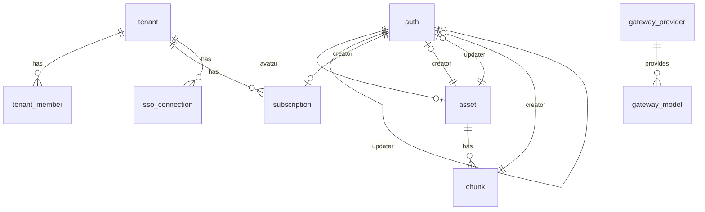
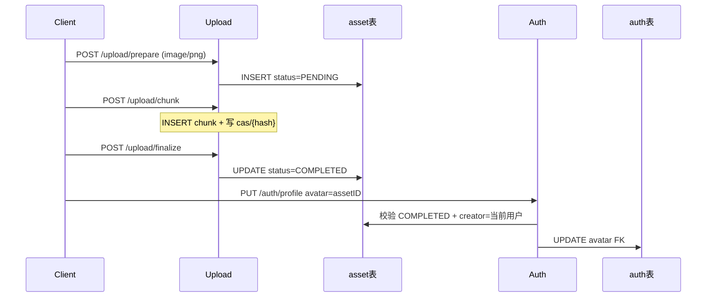

# 数据库表协作

PostgreSQL 业务表采用 **camelCase 列名**（Rust entity 字段仍为 snake_case，通过 `column_name` 映射）。

## ER 关系

| 关系                                               | 说明                                 |
| -------------------------------------------------- | ------------------------------------ |
| `auth.avatar` → `asset.id`                         | 用户头像，删除 asset 时 SET NULL     |
| `auth.creator/updater` → `auth.id`                 | 账号审计，自引用                     |
| `asset.creator/updater` → `auth.id`                | 上传/资源审计                        |
| `chunk.assetID` → `asset.id`                       | 分片归属，删除 asset 时 CASCADE      |
| `chunk.creator` → `auth.id`                        | 分片审计                             |
| `tenant_member.tenantID` → `tenant.id`             | 成员归属，删除租户时 CASCADE         |
| `tenant_member.userID` → `auth.id`                 | 成员用户，删除账号时 CASCADE         |
| `sso_connection.tenantID` → `tenant.id`            | OIDC 连接归属，删除租户时 CASCADE    |
| `gateway_model.providerID` → `gateway_provider.id` | 模型所属供应商，删除供应商时 CASCADE |
| `subscription.tenantID` → `tenant.id`              | 订阅归属，删除租户时 CASCADE         |
| `subscription.creator/updater` → `auth.id`         | 订阅审计                             |

## auth 表

Entity：[`entity/src/auth.rs`](../entity/src/auth.rs)

| 列 (DB)    | 类型        | 说明                           |
| ---------- | ----------- | ------------------------------ |
| id         | uuid PK     | 用户 ID                        |
| username   | text UNIQUE | 登录名                         |
| password   | text        | 加密后密码                     |
| email      | text        | 邮箱                           |
| phone      | text UNIQUE | 手机号（可 NULL，唯一）        |
| age        | int         | 年龄                           |
| gender     | text        | MALE / FEMALE                  |
| birthday   | date        | 生日                           |
| avatar     | uuid FK     | → asset.id                     |
| role       | text        | USER / ADMIN，默认 USER        |
| status     | text        | ACTIVE / DISABLED，默认 ACTIVE |
| archivedAt | timestamptz | 归档时间                       |
| createdAt  | timestamptz | 创建时间                       |
| creator    | uuid FK     | → auth.id                      |
| updatedAt  | timestamptz | 更新时间                       |
| updater    | uuid FK     | → auth.id                      |
| expiresAt  | timestamptz | 过期时间                       |

**使用模块**：auth（登录/profile）、user（后台 CRUD）

## asset 表

Entity：[`entity/src/asset.rs`](../entity/src/asset.rs)

| 列 (DB)                                                            | 类型    | 说明                                                            |
| ------------------------------------------------------------------ | ------- | --------------------------------------------------------------- |
| id                                                                 | uuid PK | 资源 ID                                                         |
| tenantID                                                           | text    | 租户 ID（可空）                                                 |
| kind                                                               | text    | 类型，上传为 `upload`                                           |
| hash                                                               | text    | 文件 SHA256（64 位 hex），索引；prepare 时可先空串              |
| sha                                                                | text    | finalize 校验后的整文件 SHA（与 hash 一致）                     |
| size                                                               | bigint  | 文件总字节                                                      |
| index                                                              | bigint  | 租户内列表排序（默认 0）；≠ chunk.index                         |
| mime                                                               | text    | MIME                                                            |
| extension                                                          | text    | 扩展名                                                          |
| name                                                               | text    | 文件名                                                          |
| status                                                             | text    | PENDING / UPLOADING / COMPLETED / SUPERSEDED / FAILED / EXPIRED |
| visibility                                                         | text    | PRIVATE（默认）/ PUBLIC / RESTRICTED                            |
| viewers                                                            | jsonb   | RESTRICTED 时允许下载的用户 UUID 数组；其它可见性为 null        |
| chunk                                                              | int     | 分片大小（字节）                                                |
| total                                                              | int     | 分片总数                                                        |
| archivedAt / createdAt / creator / updatedAt / updater / expiresAt |         | 审计字段                                                        |

## chunk 表

Entity：[`entity/src/chunk.rs`](../entity/src/chunk.rs)

| 列 (DB)   | 类型        | 说明                              |
| --------- | ----------- | --------------------------------- |
| id        | uuid PK     | 分片记录 ID                       |
| assetID   | uuid FK     | → asset.id，CASCADE               |
| index     | int         | 分片序号（从 0）；与 assetID 唯一 |
| hash      | text        | 分片内容 SHA256（CAS key），索引  |
| size      | bigint      | 分片字节数                        |
| createdAt | timestamptz | 创建时间                          |
| creator   | uuid FK     | → auth.id                         |

**磁盘协作**（upload 模块）：

| 路径           | 用途                                   |
| -------------- | -------------------------------------- |
| `cas/{sha256}` | 分片内容寻址单副本（跨会话零拷贝复用） |

**使用模块**：upload（分片上传）、auth/user（avatar 联查）

## tenant 表 / subscription 表

`tenant`（多租户组织）与 `subscription`（个人租户付费档位）配套使用。

**`tenant.type`**：`PERSONAL`（个人租户，走免费/订阅档位配额）或 `TEAM`（团队租户，走全局兜底配额）。
租户**不再持有** `dailyTokenQuota` 字段——配额统一由「模型覆盖 > 订阅档位 > 免费档 / 全局兜底」表达，避免显式值与档位双轨并存。

Entity：[`entity/src/subscription.rs`](../entity/src/subscription.rs)

| 列 (DB)                                    | 类型        | 说明                                                 |
| ------------------------------------------ | ----------- | ---------------------------------------------------- |
| id                                         | uuid PK     | 订阅 ID                                              |
| tenantID                                   | uuid FK     | → tenant.id，CASCADE，索引                           |
| plan                                       | text        | 档位名，对应 `gateway.plan_daily_token_quota` 的 key |
| status                                     | text        | ACTIVE / CANCELED / EXPIRED，默认 ACTIVE             |
| expiresAt                                  | timestamptz | 到期时间；**NULL = 永久有效**                        |
| createdAt                                  | timestamptz | 订阅创建时间；**创建即生效**，故也是生效开始时间     |
| archivedAt / creator / updatedAt / updater |             | 审计字段                                             |

**生效判定**：`status = ACTIVE` 且 `archivedAt IS NULL` 且（`expiresAt IS NULL` 或 `expiresAt > now`）。
订阅**创建即生效**（`createdAt` 即生效时间），不支持预约未来开始时间，因此没有独立的 `startAt`。
同一租户同一时刻**最多一条生效订阅**——由部分唯一索引 `uidx_subscription_active`（`ON subscription ("tenantID") WHERE status = 'ACTIVE'`）在 DB 层强制；
开通/续订在一个事务内先把旧订阅标为 `EXPIRED`/`CANCELED`（未过期的 `expiresAt` 截断到当前时间）再插入新记录，取消则把 `expiresAt` 截断到当前时间。

**使用模块**：subscription（开通/续订/取消）、gateway（配额解析）

## tenant_member 表

Entity：[`entity/src/tenant_member.rs`](../entity/src/tenant_member.rs)

| 列 (DB)                                                            | 类型    | 说明                           |
| ------------------------------------------------------------------ | ------- | ------------------------------ |
| id                                                                 | uuid PK | 成员记录 ID                    |
| tenantID                                                           | uuid FK | → tenant.id，CASCADE           |
| userID                                                             | uuid FK | → auth.id，CASCADE             |
| role                                                               | text    | OWNER / ADMIN / MEMBER         |
| status                                                             | text    | ACTIVE / DISABLED，默认 ACTIVE |
| archivedAt / createdAt / creator / updatedAt / updater / expiresAt |         | 审计字段                       |

`(tenantID, userID)` 唯一（`uidx_tenant_member`）。
**使用模块**：tenant（成员 CRUD）、sso（回调时按连接所属租户建成员）

## gateway_provider / gateway_model 表

Entity：[`entity/src/gateway_provider.rs`](../entity/src/gateway_provider.rs)、[`entity/src/gateway_model.rs`](../entity/src/gateway_model.rs)

| 列 (DB)                                                            | 类型    | 说明                                                     |
| ------------------------------------------------------------------ | ------- | -------------------------------------------------------- |
| **gateway_provider.id**                                            | uuid PK | 供应商 ID                                                |
| tenantID                                                           | uuid    | 租户级供应商；NULL = 平台默认，索引                      |
| kind                                                               | text    | openai / anthropic / deepseek / qwen / zhipu / ollama    |
| name / baseURL                                                     | text    | 展示名与上游基址                                         |
| apiKeyEnc                                                          | text    | 上游 API Key，AES-256-GCM 密文；空 = 无密钥（如 ollama） |
| status                                                             | text    | ACTIVE / DISABLED，默认 ACTIVE                           |
| **gateway_model.id**                                               | uuid PK | 模型 ID                                                  |
| providerID                                                         | uuid FK | → gateway_provider.id，CASCADE                           |
| tenantID                                                           | uuid    | 租户级模型；NULL = 平台默认，索引                        |
| name / label                                                       | text    | 模型标识（如 gpt-4o）与展示名                            |
| allowRoles                                                         | jsonb   | 允许调用的角色数组；NULL = 全角色放行                    |
| enabled                                                            | boolean | 默认 true                                                |
| dailyTokenQuota                                                    | bigint  | 模型级日配额；0 = 继承租户（默认 0）                     |
| archivedAt / createdAt / creator / updatedAt / updater / expiresAt |         | 审计字段（两表同）                                       |

`apiKeyEnc` 的加密密钥来自 `security.aes_key`。
**使用模块**：gateway（供应商/模型管理、转发时解析）

## gateway_usage / gateway_audit 表

Entity：[`entity/src/gateway_usage.rs`](../entity/src/gateway_usage.rs)、[`entity/src/gateway_audit.rs`](../entity/src/gateway_audit.rs)

这两张是**追加型**表，**不设外键**（避免删除模型/租户时影响历史）。

| 列 (DB)                                       | 类型        | 说明                          |
| --------------------------------------------- | ----------- | ----------------------------- |
| **gateway_usage.id**                          | uuid PK     | 用量 ID                       |
| tenantID                                      | uuid        | 可空，索引                    |
| userID                                        | uuid        | 调用者，索引                  |
| providerID / modelID                          | uuid        | 供应与模型，索引              |
| promptTokens / completionTokens / totalTokens | bigint      | 默认 0                        |
| status                                        | text        | OK / QUOTA / UPSTREAM / ERROR |
| latencyMs                                     | bigint      | 默认 0                        |
| createdAt                                     | timestamptz | 索引                          |
| **gateway_audit.id**                          | uuid PK     | 审计 ID                       |
| tenantID                                      | uuid        | 可空                          |
| actor                                         | uuid        | 操作者，索引                  |
| action / resource                             | text        | 动作与资源                    |
| detail                                        | jsonb       | 详情，可空                    |
| ip                                            | text        | 可空                          |
| createdAt                                     | timestamptz | 索引                          |

用量另同步写入 ES 索引 `gateway.usage_es_index`（默认 `gateway_usage`）。
**使用模块**：gateway（转发落库/审计，后台用量与审计查询）

## sso_connection 表

Entity：[`entity/src/sso_connection.rs`](../entity/src/sso_connection.rs)

| 列 (DB)                                                            | 类型    | 说明                           |
| ------------------------------------------------------------------ | ------- | ------------------------------ |
| id                                                                 | uuid PK | 连接 ID                        |
| tenantID                                                           | uuid FK | → tenant.id，CASCADE           |
| provider                                                           | text    | oidc / saml（saml 预留）       |
| issuer                                                             | text    | OIDC Issuer                    |
| clientID                                                           | text    | 客户端 ID                      |
| clientSecretEnc                                                    | text    | 客户端密钥，AES-256-GCM 密文   |
| redirectUri                                                        | text    | 回调地址                       |
| status                                                             | text    | ACTIVE / DISABLED，默认 ACTIVE |
| archivedAt / createdAt / creator / updatedAt / updater / expiresAt |         | 审计字段                       |

**使用模块**：sso（连接 CRUD、OIDC 授权码流程）

## 审计字段约定

`archivedAt`、`createdAt`、`creator`、`updatedAt`、`updater`、`expiresAt` 在 auth / asset 上语义一致：

- **createdAt / creator**：创建时间与创建者
- **updatedAt / updater**：最后更新
- **archivedAt**：软归档/失败标记
- **expiresAt**：过期时间（上传任务默认 24h；订阅到期，NULL = 永久有效）

## 跨模块流程：头像绑定

## 迁移

全部表由**单一代际**迁移 [`migration/src/000001_20260819.rs`](../migration/src/000001_20260819.rs) 建出（含 `auth` 的 `phone` / `gender` / `birthday` / `avatar`）；改 schema 直接改这个文件，重建用 `sea-orm-cli migrate fresh`。
列名与 `DeriveIden` 的注意事项见 [`migration/README.md`](../migration/README.md#列名约定)。

详见 [`migration/README.md`](../migration/README.md)。
