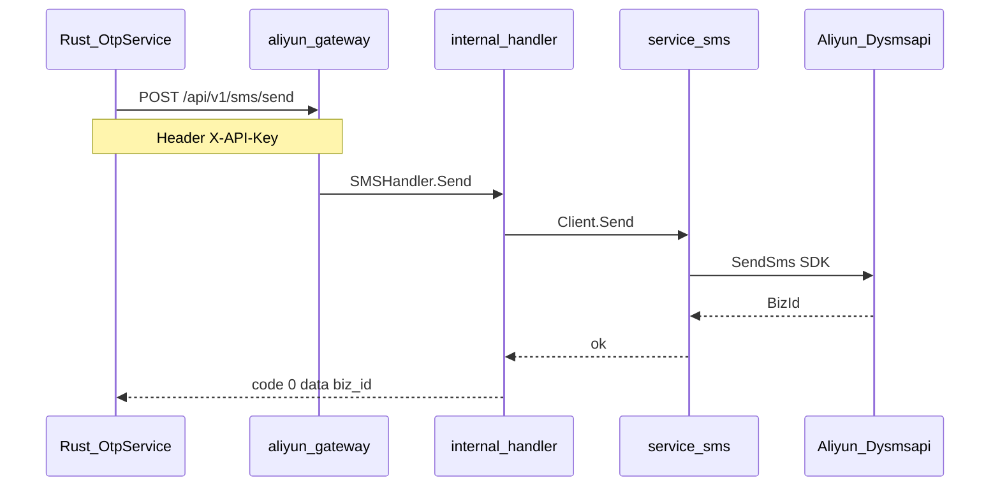

# aliyun-gateway

内网 HTTP 网关，封装阿里云官方 Go SDK。Rust 主服务通过 [`src/clients/aliyun_gateway.rs`](../../src/clients/aliyun_gateway.rs) 调用。

Go 入门与命令速查见 [`../README.md`](../README.md)。

## 架构



**职责边界**

| 组件 | 职责 |
|------|------|
| Rust `OtpService` | 生成验证码、Redis 冷却/锁定、何时发送 |
| Rust `AliyunGatewayClient` | HTTP 调用侧车，不含 AK/SK |
| 本服务 | 持有 AK/SK，调用官方 SDK，返回统一 JSON 信封 |

## 文件地图

| 路径 | 职责 |
|------|------|
| `command/server/main.go` | 启动、读配置、优雅退出 |
| `internal/server/router.go` | 路由注册 |
| `internal/config/` | 加载 `config.json` + `config.local.json` 覆盖 |
| `internal/middleware/` | `X-API-Key` 校验 |
| `internal/handler/` | HTTP 请求/响应、错误映射 |
| `internal/service/sms/` | Dysmsapi SDK 封装 |
| `internal/service/oss/` | 预留（阶段 2） |
| `internal/service/mail/` | 预留（阶段 2） |

## 配置（两张皮）

| 配置位置 | 内容 | 谁读 |
|----------|------|------|
| Rust `config.yaml` → `aliyun.gateway.*` | `base_url`、`api_key`、`timeout_ms`、`sms_template_code` | Rust 客户端 |
| `docker/aliyun-gateway/config.json` | 监听地址、`api_keys`、区域、签名、默认模板 | 本服务 |
| `docker/aliyun-gateway/config.local.json` | **AK/SK**（不入库） | 本服务覆盖 |

`api_key`（Rust）必须与 `server.api_keys`（Go）中之一一致。

### 本地开发方式

| 方式 | 步骤 | 适用 |
|------|------|------|
| **Docker** | `docker compose up -d aliyun-gateway` | 推荐，与生产一致 |
| **go run** | 设置 `CONFIG` 指向 JSON，执行 `go run ./command/server` | 调试 Go 代码 |

Docker 要用真实短信，必须：

1. 复制 `docker/aliyun-gateway/config.local.json.example` → `config.local.json`，填入 AK/SK
2. 在 [`docker-compose.yml`](../../docker-compose.yml) **取消注释** `config.local.json` 挂载行
3. `docker compose up -d aliyun-gateway`

否则容器内缺少 AK/SK，`/api/v1/sms/send` 返回 **503**。

`go run` 本地调试时，`config.Load` 会自动读取与 `config.json` 同目录的 `config.local.json`：

```powershell
Copy-Item ..\..\docker\aliyun-gateway\config.local.json.example ..\..\docker\aliyun-gateway\config.local.json
# 编辑 AK/SK、签名、模板

$env:CONFIG = "..\..\docker\aliyun-gateway\config.json"
go run ./command/server
```

## 能力

| 端点 | 状态 | 说明 |
|------|------|------|
| `GET /healthz` | 已实现 | 健康检查 |
| `POST /api/v1/sms/send` | 已实现 | Dysmsapi 短信 |
| `POST /api/v1/oss/presign` | 预留 | 返回 501 |
| `POST /api/v1/mail/send` | 预留 | 返回 501 |

所有 `/api/v1/*` 路由需要 `X-API-Key` 头。

## 构建与测试

```powershell
go test ./...
go build -o aliyun-gateway.exe ./command/server
```

## 短信 API 示例

```http
POST /api/v1/sms/send
X-API-Key: change-me-aliyun-gateway-key
Content-Type: application/json

{
  "phone": "13800138000",
  "template_code": "SMS_xxxx",
  "template_param": { "code": "123456" }
}
```

成功响应：

```json
{ "code": 0, "message": "ok", "data": { "biz_id": "..." } }
```

## 排错

| 现象 | 原因 | 处理 |
|------|------|------|
| `503 sms client not configured` | 缺 AK/SK 或签名/模板 | 配置 `config.local.json` 并挂载到容器 |
| `401 missing X-API-Key` | 请求未带头 | Rust / curl 加 `X-API-Key` |
| `403 invalid API key` | Rust 与 Go 的 key 不一致 | 对齐 `config.yaml` 与 `config.json` 的 api_key |
| `go mod download` 超时 | 国内网络 | `$env:GOPROXY = "https://goproxy.cn,direct"` |
| Rust OTP 仍打日志不发短信 | `auth.otp.mock: true` | 开发默认 mock；联调设 `mock: false` |
