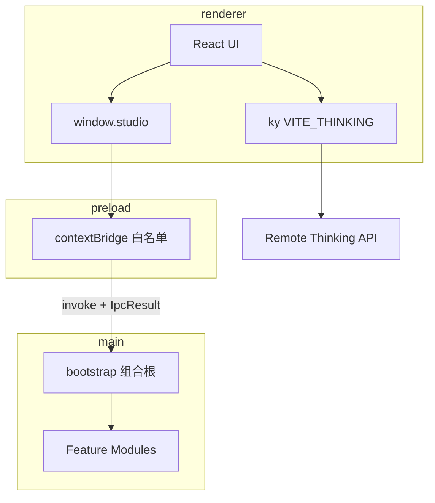

# Studio 架构方案

## 1. 定位

**i thinking Studio**（`@i-thinking/studio`）是 monorepo 内的 **Electron 桌面壳**：

| 做 | 不做 |
|----|------|
| Forge + Vite 多进程桌面应用 | 嵌入 NestJS sidecar |
| Main 域模块 + 组合根 | Tauri 式 Plugin 注册 API |
| 契约 IPC（`window.studio`） | 暴露裸 `ipcRenderer` |
| 本地能力：store / dialog / SQLite 仓储 / sidecar | Renderer 任意 SQL |
| 业务 HTTP → 远程 `VITE_THINKING` | 本地再起一套 Nest |

独立后端 [`apps/service`](../../service) 可单独部署，与 Studio **零运行时耦合**。

## 2. 进程与数据流



- **Renderer**：UI、远程 API 客户端；通过 `findStudio()` 调本地能力。
- **Preload**：唯一桥；把 `IpcResult` 失败转为 `throw`。
- **Main**：窗口、安全会话、IPC handlers、Prisma、白名单 sidecar。
- **shared**：仅 channel / zod / 类型 / `IpcResult`（无 Node、无 Electron）。

## 3. 目录边界

```text
apps/studio/
├── sidecar/        # Cargo workspace + staging + manifest（企业级侧车）
└── src/
    ├── main/       # @main — Electron Main
    │   ├── bootstrap.ts
    │   ├── app-context.ts
    │   ├── paths.ts    # bundle / APP_ROOT / createRequire（规避 CJS 下 import.meta）
    │   ├── ipc/
    │   └── modules/    # 含 sidecar 运行时模块
    ├── preload/        # @preload — contextBridge
    ├── renderer/       # @ → 此处 — React 应用
    └── shared/         # @shared — 跨进程契约
```

| 别名 | 指向 | 谁可用 |
|------|------|--------|
| `@/*` | `src/renderer/*` | renderer |
| `@main/*` | `src/main/*` | main |
| `@shared/*` | `src/shared/*` | 三进程 |
| `@preload/*` | `src/preload/*` | preload |

ESLint 禁止 renderer 引用 `@main` / `electron`，禁止 main 引用 `@/`（renderer）。

tsconfig 按进程拆分：`tsconfig.main.json` / `tsconfig.preload.json` / `tsconfig.renderer.json`。

## 4. 组合根与模块

[`src/main/bootstrap.ts`](../src/main/bootstrap.ts) 在 `app.whenReady()` 后显式注册：

1. security  
2. store  
3. dialog  
4. database  
5. sidecar  
6. devtools  
7. window  

每个模块实现：

```ts
interface StudioModule {
  name: string
  register: (ctx: AppContext) => void | Promise<void>
  dispose?: () => void | Promise<void>
}
```

退出时 `before-quit` **等待**逆序 `dispose`（如 Prisma disconnect）再 `app.exit`。

模块内部分层（有业务时）：

```text
handlers.ts   → sender 校验 + 本模块 schemas + 调 service 或 repository
schemas.ts    → 手写类型 + zod 校验；禁止 z.infer
service.ts    → 可选用例（编排 / 事务）；禁止 CRUD 1:1 透传
repositories/ → 仅 database；SQL 不出 Main；纯 CRUD 可直接被 handlers 调用
index.ts      → buildModule()（域外别名导入）
```

详见 [modules.md](./modules.md)。

## 5. IPC 契约

- Channel 格式：`namespace:action`（见 [`channels.ts`](../src/shared/ipc/channels.ts)）
- 入参/出参类型与 zod：同域 `modules/<domain>/schemas.ts`（手写类型 + 校验，禁止 `z.infer`）
- 返回：`IpcResult<T>`（[`result.ts`](../src/shared/ipc/result.ts)）
- 前端形状：`Studio`（[`studio.ts`](../src/shared/ipc/studio.ts)）
- 暴露名：仅 `window.studio`

Main 侧 `registerHandler`：校验 **已登记 webContents** + **允许 URL**（开发绑定 Vite origin，生产 `file:`）→ zod → 业务 → `ipcOk` / `ipcFail`。

完整表见 [api-reference.md](./api-reference.md)；调用见 [examples.md](./examples.md)。

## 6. 安全原则（摘要）

- `contextIsolation: true`、`nodeIntegration: false`、`sandbox: true`、`webSecurity: true`
- CSP 由 security 模块注入 response headers
- 导航 / `window.open` 受限
- DevTools 仅非打包（`!app.isPackaged`）
- 无任意 SQL IPC；sidecar 白名单
- Fuses：关闭 `RunAsNode` / Node CLI 相关开关

详见 [security.md](./security.md)。

## 7. 数据与路径

- SQLite + Prisma（better-sqlite3 adapter），库文件在 `userData/databases/`
- 仅领域命令：`user:list|create|update|remove`
- Main / Preload 为 **CJS**（`type: commonjs` + Forge 默认）；路径与 `createRequire` 统一用 [`paths.ts`](../src/main/paths.ts)（`process.argv[1]` / `APP_ROOT`）

## 8. 关键决策

| 决策 | 理由 |
|------|------|
| 组合根而非装饰器 DI | 可读、可测、无框架锁死 |
| 去 Nest sidecar | 企业桌面壳与后端分离；HTTP 已走远程 |
| 仓储 IPC 替代 raw SQL | XSS 不可升级为整库读写 |
| 自研 bridge + `IpcResult` | 与 Electron 模型一致，契约单源 |
| paths.ts | 规避 Vite CJS 对 `import.meta.url` 的破坏 |
