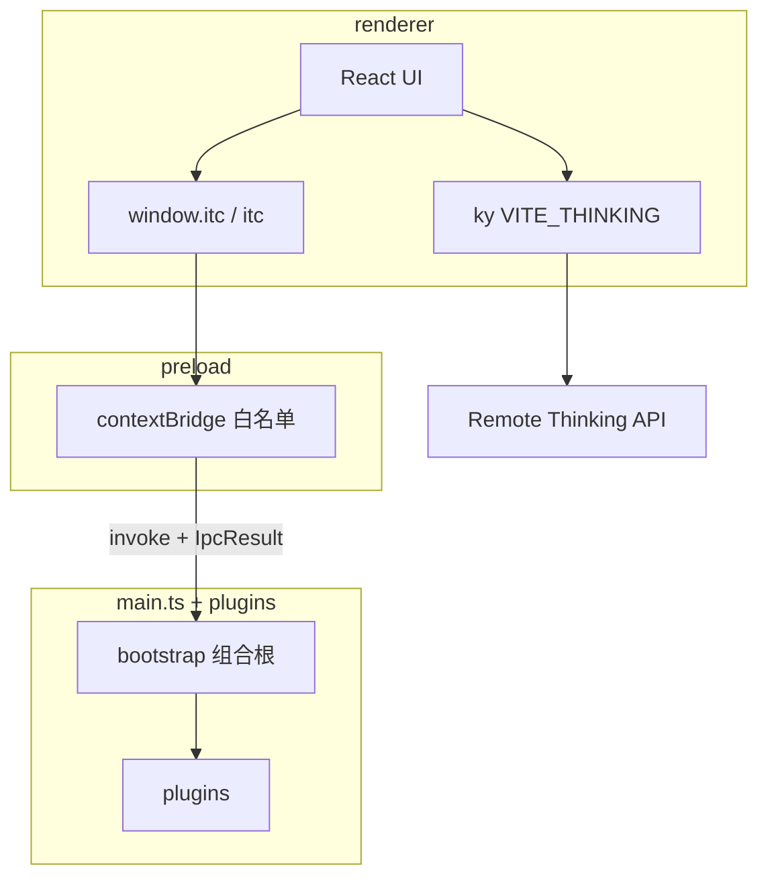

# Studio 架构

> SSOT：goose 式入口扁平 + Tauri plugin 语义；宿主能力聚合在 `src/plugins/`。

## 1. 定位

**i thinking Studio**（`@i-thinking/studio`）是 monorepo 内的 Electron 桌面壳：

| 做 | 不做 |
|----|------|
| Forge + Vite 多进程桌面应用 | NestJS 嵌在 Main |
| plugins 能力单元 + 薄组合根 | 跨进程物理 feature 共目录 |
| 契约 IPC（`window.itc` / 全局 `itc`） | 暴露裸 `ipcRenderer` |
| 本地能力：store / dialog / SQLite / sidecar | Renderer 任意 SQL |
| 业务 HTTP → 远程 `VITE_THINKING` | 本地再起一套 Nest |

独立后端 `apps/service` 与 Studio **零运行时耦合**。

## 2. 进程与数据流



| 层 | 职责 | 禁止 |
|----|------|------|
| **plugins** | 宿主能力：契约 + desktop 实现 + commands + init（单文件/域） | 依赖 UI（`@/`） |
| **preload** | `ITC` → `ipcRenderer.invoke/on`；仅 `channels` / `result` / `itc` | 业务逻辑、其它 plugin 实现 |
| **renderer** | UI + 远程 HTTP；全局 `itc` / `findITC()` | `electron`、plugin 实现（可 `import type` `itc`） |
| **forge** | 打包 / makers / hooks / sidecar stage | 业务代码、IPC 契约 |

## 3. 目录

```text
apps/studio/
├── forge/          # 打包 only
├── sidecar/        # staging 二进制
├── index.html
└── src/
    ├── main.ts       # 薄组合根
    ├── preload.ts
    ├── renderer.tsx
    ├── App.tsx
    ├── plugins/      # 唯一宿主聚合
    │   ├── channels.ts / result.ts / itc.ts
    │   ├── context / handle / logger / …
    │   └── store.ts / dialog.ts / …（域单文件）
    └── …             # UI（@ → src/）
```

ESLint：renderer / preload / host（`main.ts` + `plugins/**`）边界规则。

## 4. 组合根与插件

[`main.ts`](../src/main.ts) 注册顺序：

1. security → 2. store → 3. dialog → 4. database → 5. window → 6. devtools → 7. updater → 8. doc → 9. screenshot → 10. sidecar

本地 IPC（含 DevTools）先于 sidecar；`corex.start()` 后台执行，失败降级不挡 UI。

```ts
interface Plugin {
  name: string
  register: (ctx: Context) => void | Promise<void>
  dispose?: () => void | Promise<void>
}
```

域插件单文件：`models`（类型+zod）+ `desktop` + `commands`（`registerHandler`）+ `buildPlugin()`。

## 5. IPC 契约

- Channel：`namespace:action`（[`channels.ts`](../src/plugins/channels.ts)）
- DTO + zod：各域 `plugins/<domain>.ts`（对象用 `interface`；zod 为 `ReadSchema` 大驼峰；禁止 `z.infer` 当业务类型）
- 返回：`IpcResult<T>`（[`result.ts`](../src/plugins/result.ts)）
- 前端形状：`ITC`（[`itc.ts`](../src/plugins/itc.ts)）
- 暴露名：仅 `window.itc`（全局标识符 `itc`）
- 契约同步：[`contract.test.ts`](../src/plugins/contract.test.ts)

## 6. 安全（摘要）

- `contextIsolation: true`、`nodeIntegration: false`、`sandbox: true`
- trusted sender + 允许 origin / `file:`
- 无任意 SQL IPC；无 Renderer 通用 sidecar spawn

## 7. 扩展新域

```text
1. plugins/channels.ts
2. plugins/<domain>.ts（models + desktop + commands + buildPlugin）
3. plugins/itc.ts
4. main.ts 注册
5. preload.ts 挂载
6. contract.test 绿 + api-reference / examples
```

## 8. 决策

| 决策 | 理由 |
|------|------|
| `src/plugins/` 单目录 | UI 已占 `src/` 根；对齐 Tauri 能力单元 + goose 单文件粒度 |
| 删除 main/ + shared/ | 避免双轨与三层 handlers/service/schema |
| 薄组合根 | 不抄 goose 巨石 main.ts |
| paths.ts / Forge CJS | 打包现实约束 |
