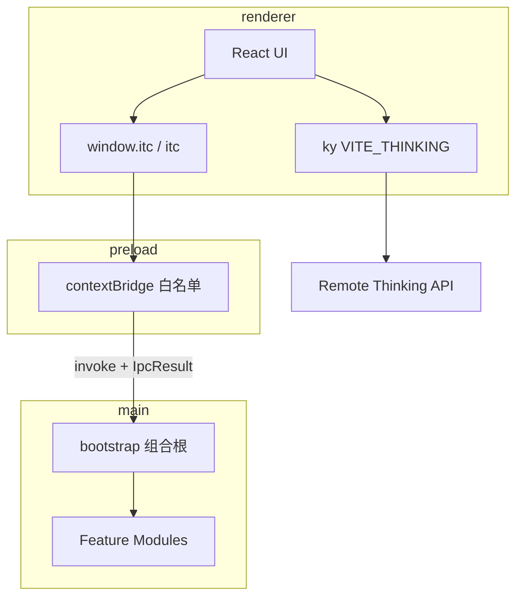

# Studio 架构

> SSOT：破坏性去兼容后的工程基线。旧文档描述仅作历史参考。

## 1. 定位

**i thinking Studio**（`@i-thinking/studio`）是 monorepo 内的 Electron 桌面壳：

| 做 | 不做 |
|----|------|
| Forge + Vite 多进程桌面应用 | NestJS 嵌在 Main |
| Main 域模块 + 组合根 | 跨进程物理 feature 共目录 |
| 契约 IPC（`window.itc` / 全局 `itc`） | 暴露裸 `ipcRenderer` |
| 本地能力：store / dialog / SQLite / sidecar | Renderer 任意 SQL |
| 业务 HTTP → 远程 `VITE_THINKING` | 本地再起一套 Nest |

独立后端 `apps/service` 与 Studio **零运行时耦合**。

## 2. 进程与数据流



| 层 | 职责 | 禁止 |
|----|------|------|
| **shared** | CHANNELS、**仅 IPC** DTO（类型 + zod）、`Studio`、`IpcResult` | `electron`、Node I/O、`@main`、业务副作用 |
| **main** | 组合根、域模块、安全、sidecar 宿主；main-only 内部类型 | 依赖 renderer |
| **preload** | `Studio` → `ipcRenderer.invoke/on` | 业务逻辑 |
| **renderer** | UI + 远程 HTTP；全局 `itc` / `findItc()` | `@main`、`electron` |
| **forge** | 打包 / makers / hooks / sidecar stage | 业务代码、IPC 契约 |

依赖单向：`shared ← main | preload | renderer`。

## 3. 目录

```text
apps/studio/
├── forge/          # 打包 only
├── sidecar/        # staging 二进制
└── src/
    ├── main/       # @main
    ├── preload/    # @preload
    ├── renderer/   # @ → 此处
    └── shared/     # @shared — IPC 契约
        └── ipc/    # channels / studio / result / <domain> DTO
```

ESLint：renderer / preload / main / **shared** 均有进程边界规则。

## 4. 组合根与模块

[`bootstrap.ts`](../src/main/bootstrap.ts) 注册顺序：

1. security → 2. store → 3. dialog → 4. database → 5. window → 6. devtools → 7. updater → 8. doc → 9. screenshot → 10. sidecar

本地 IPC（含 DevTools）先于 sidecar；`corex.start()` 后台执行，失败降级不挡 UI。

```ts
interface StudioModule {
  name: string
  register: (ctx: AppContext) => void | Promise<void>
  dispose?: () => void | Promise<void>
}
```

模块内：

```text
handlers.ts   → Zod + registerHandler → service / repository
service.ts    → 可选用例（非 CRUD 透传）
repositories/ → 仅 database
index.ts      → buildModule()
```

IPC 出入参在 **`src/shared/ipc/<domain>.ts`**，不在 main。

## 5. IPC 契约

- Channel：`namespace:action`（[`channels.ts`](../src/shared/ipc/channels.ts)）
- DTO + zod：[`shared/ipc/<domain>.ts`](../src/shared/ipc/)（对象用 `interface`；zod 为 `ReadSchema` 大驼峰；禁止 `z.infer` 当业务类型）
- 返回：`IpcResult<T>`
- 前端形状：`Studio`（[`studio.ts`](../src/shared/ipc/studio.ts)）
- 暴露名：仅 `window.itc`（全局标识符 `itc`）
- 契约同步：[`contract.test.ts`](../src/shared/ipc/contract.test.ts)

## 6. 安全（摘要）

- `contextIsolation: true`、`nodeIntegration: false`、`sandbox: true`
- trusted sender + 允许 origin / `file:`
- 无任意 SQL IPC；无 Renderer 通用 sidecar spawn

## 7. 扩展新域

```text
1. shared/ipc/channels.ts
2. shared/ipc/<domain>.ts（类型 + zod）
3. shared/ipc/studio.ts
4. main/modules/<domain>/
5. bootstrap.ts
6. preload/preload.ts
7. contract.test 绿 + api-reference / examples
```

## 8. 决策

| 决策 | 理由 |
|------|------|
| 组合根而非 DI 容器 | 可读、可测、无框架锁死 |
| IPC DTO 仅进 shared | 切断 shared→main 倒置 |
| 破坏性去兼容 | 不留 Corex legacy / 空壳 record |
| AppContext.corex 暂留 | 单 daemon；第二 sidecar 再抽 Port |
| paths.ts / Forge CJS | 打包现实约束，非业务兼容层 |
