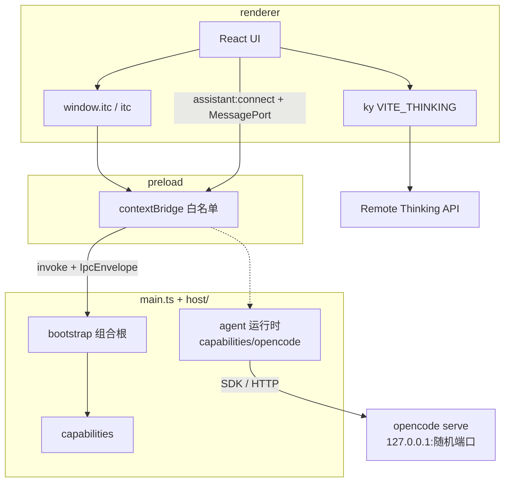

# Studio 架构

> SSOT：Forge 扁平进程入口 + 按角色的宿主层（`src/host/`）；契约独立成层（`src/shared/ipc/`，框架无关）。

## 1. 定位

**i thinking Studio**（`@i-thinking/studio`）是 monorepo 内的 Electron 桌面壳：

| 做                                          | 不做                      |
| ------------------------------------------- | ------------------------- |
| Forge + Vite 多进程桌面应用                 | NestJS 嵌在 Main          |
| host 能力模块 + 薄组合根                    | 跨进程物理 feature 共目录 |
| 契约 IPC（`window.itc` / 全局 `itc`）       | 暴露裸 `ipcRenderer`      |
| 本地能力：store / dialog / SQLite / sidecar | Renderer 任意 SQL         |
| 业务 HTTP → 远程 `VITE_THINKING`            | 本地再起一套 Nest         |
| Agent 运行：内嵌 `opencode serve` + SDK     | 主进程自己实现 agent 循环 |

独立后端（Rust 服务，独立仓库）与 Studio **零运行时耦合**：它只做业务 —— 登录/注册、租户与配额、
订阅、网关目录与管理面。**agent 运行不经过它**，运行时是内嵌在本机的 opencode（见 §4），
studio 与服务端之间只有 HTTP。

## 2. 进程与数据流



| 层           | 职责                                                       | 禁止                                            |
| ------------ | ---------------------------------------------------------- | ----------------------------------------------- |
| **host**     | 宿主能力：框架 + IPC 装配 + 能力域实现 + 生命周期          | 依赖 UI（`@/`）                                 |
| **preload**  | `Api` → `ipcRenderer.invoke/on`；只碰 `shared/ipc/` 的契约 | 业务逻辑、`host/**`、让频道字符串外流           |
| **renderer** | UI + 远程 HTTP；全局 `itc`                                 | `electron`、host 实现（可 `import type` `itc`） |
| **forge**    | 打包 / makers / hooks / sidecar stage                      | 业务代码、IPC 契约                              |

## 3. 目录

```text
apps/studio/
├── forge/          # 打包 only
├── sidecar/        # staging 二进制
├── index.html
└── src/
    ├── main.ts       # 薄组合根
    ├── preload.ts    # 纯适配器
    ├── preload.port.ts  # agent 运行时端口（竞态队列）
    ├── renderer.tsx
    ├── App.tsx
    ├── shared/ipc/   # 契约：零 electron / node / dom import
    │   ├── channels.ts  spec.ts  specs/  api.ts  error.ts
    ├── host/         # 主进程
    │   ├── framework/     # 插件框架：module / context / logger / paths
    │   ├── ipc/           # IPC 装配：types / register / handlers/
    │   ├── capabilities/  # 能力域实现：sidecar / chat / database / assistant / security …
    │   │   ├── assistant*.ts  # 端口装配、协议、密钥、审批（Electron 侧接线）
    │   │   └── opencode/      # agent 运行时：spawn + 配置 + 事件 + 变更卡
    │   └── lifecycle/     # 进程生命周期：single-instance
    └── …             # UI（@ → src/）：views / features / stores / apis
```

`features/` 里与本层相关的两块：`features/chat/port/`（渲染侧的端口实现，把 UI 意图翻成端口消息）
与 `features/quota/`（租户、配额、发送前门禁，见 §4）。

各层的边界含义：

| 层                   | 放什么                         | 判据                                                       |
| -------------------- | ------------------------------ | ---------------------------------------------------------- |
| `shared/ipc/`        | 频道、schema、派生类型、错误码 | 被三端同时打包；`shared-framework-free` 规则强制零框架依赖 |
| `host/framework/`    | 插件机制与主进程基建           | 被能力域引用，自身不引用能力域                             |
| `host/ipc/`          | handler 实现与注册装配         | 频道字符串的唯一来源是契约                                 |
| `host/capabilities/` | 域的服务实现（**不再是插件**） | 被 `host/ipc/handlers` 调用                                |
| `host/lifecycle/`    | 进程级钩子，非插件             | 在 `main.ts` 里直接调用而非注册                            |

ESLint：renderer / preload / host / shared 四条边界规则（`eslint.config.ts`）。

## 4. 对话：一条链路，两种模型来源

| 来源                  | 端点与凭据                                                              | 要点                                                                          |
| --------------------- | ----------------------------------------------------------------------- | ----------------------------------------------------------------------------- |
| 我的模型（本机 BYOK） | 用户填的 OpenAI 兼容 `baseUrl`；密钥来自 safeStorage                    | 密钥只进主进程，渲染进程不读回                                                |
| 组织模型（平台网关）  | `findGatewayBaseURL()` = `${VITE_THINKING}/gateway`；凭据是当前登录令牌 | 网关是 provider 表里固定的一行（id `platform-gateway`），模型由服务端目录下发 |

- **运行链路只有一条**：renderer → `assistant:connect` → MessagePort（纯数据，不用 IPC 传每个 token）
  → main 的 [`capabilities/assistant.ts`](../../../apps/studio/src/host/capabilities/assistant.ts)（只做 Electron 接线）
  → [`capabilities/opencode/`](../../../apps/studio/src/host/capabilities/opencode/engine.ts) 的引擎
  → 内嵌的 `opencode serve`（HTTP/SSE，127.0.0.1 随机端口）。来源差异只落在
  `host/capabilities/assistant-model.ts` 的 `resolveConnection` 一处，所以两种来源共用同一份
  历史适配器、会话、工具、审批与计划。
- **agent 循环不在 studio 里**：工具执行、上下文压缩、文件快照、子任务、MCP 都是 agent 运行时的本体，
  由 opencode 承担；studio 只做三件事 —— 把 provider/凭据喂给它、把事件翻成端口协议、把审批权握在手里。
  细节（进程生命周期、目录隔离、事件按目录分发、审批三档、变更卡来源）见
  [online-models.md](./online-models.md) §7.3。
- **没有通路开关**：`useLocalRuntime` + `ChatModelPort` 是唯一的 runtime hook（`features/chat/runtime.tsx`），
  旧的 `chat.transport` / `key={kind}` / `createOnlineTransport` 都已删除。
- **会话 id 的取法只有两条**（`ThreadIdentity`，见
  [`packages/chat/src/adapters/thread-history.ts`](../../../packages/chat/src/adapters/thread-history.ts)）：
  **写**（`append` 落历史、`findHost` 报会话）先 `await threadListItem.initialize()` 再取
  `remoteId`；**读**（`load`）只看快照，没有会话就是空历史 —— 读历史不该把空会话建出来。
  DB 会话 id 落库后才存在（新建线程在此之前只有 `__LOCALID_x`），而 promotion / reconcile 期间
  `getState().remoteId` 可能还停在旧快照上，所以写路径不能拿快照里的空值去写。
  这条不变量**没有 UI 兜底**：assistant-ui 会吞掉历史写入的 rejection
  （`void historyWrite?.catch(() => {})`），写失败的表现是「消息发出去了、库里没有，随后助手
  写回复时崩在 `parentID` 外键」，只能靠 DB 取证。主进程侧的
  `CHAT_MESSAGE_APPEND_FAILED` 会把当事 id 与它们是否在库一并报出来。
- **平台行由目录派生**：发送前 `ensurePlatformProvider()` 读 `GET /gateway/models` 写成 provider 行，
  与目录一致就不写库；未配 `VITE_THINKING` 或未登录时返回 null（不落库），选择器提示未就绪原因。
- **模型清单**：目录下发 `name` / `label` / `capabilities` / `contextWindow` / `providerName`，
  缺省按 `packages/agent/src/provider.ts` 的契约兜底；首项 `auto` 由服务端补全。
  选中项落 `chat.providerID` + `chat.model`，请求里 `model` 就是目录里的 `name`。
- **「自动」= 不钉 provider**（`chat.providerID === null`）：发之前现挑，平台那行（`kind: 'gateway'`）
  排在 BYOK 之前、组内保持 IPC 顺序，于是「登录了用组织模型、没登录退回本机」是同一套推导
  （[`port/model.ts`](../../../apps/studio/src/features/chat/port/model.ts) 的 `findFallbackProvider`），
  不是两条链路。**发送链路只有一份推导** —— `resolveTarget`（发什么）与 `findTargetLabel`
  （界面说什么）同源，模型选择器与右栏「生效模型」都读它，谁都不自己拼文案，否则右栏说的模型
  和真正跑的不是同一个。平台行由目录派生，退登后残留的那行会被 `dropStalePlatformRow()` 在读库时丢掉。
- **登录态是唯一身份源**：令牌由 [`utils/auth.ts`](../../../apps/studio/src/utils/auth.ts) 的
  `subscribeAuthToken` 提供**订阅式**读取，[`features/account/session.ts`](../../../apps/studio/src/features/account/session.ts)
  的 `useAccountSession()` 把它落成「资料 + 展示身份」。agent 左栏账号区、**主窗口标题栏账号位**
  （两者共用 [`features/account/account-menu.tsx`](../../../apps/studio/src/features/account/account-menu.tsx)
  的 `AccountMenuContent`，所以「退出登录」只有一份实现）、设置页「账号」分组、
  「平台」分组的可见性都从这一处派生 —— 不再各读各的 `localStorage`、各写各的假「本地」身份，
  也不再有「登录后标题栏还挂着登录按钮」这种两套状态。
  资料取 `GET /auth/profile`，令牌里的 `username` / `role` 只在资料读不到时兜底；令牌被判失效
  （服务端 `300001` / `300002` / `300003`）就主动清掉本地令牌（留着只会让每个接口都失败、界面还显示已登录），
  网络不通则**保留**令牌（只是暂时显示不出资料）。退出先打 `POST /auth/signout` 把令牌作废，
  失败也只清本地 —— 不把用户困在登录态里。
- **管理面只对管理员露出**：设置页的「平台」分组（供应商 / 平台模型 / 用量 / 审计）只在登录令牌
  payload 的 `role === "ADMIN"` 时渲染；服务端同样以 ADMIN 鉴权（非管理员 `300006`），
  所以前端隐藏只是少一次无用请求，不是安全边界。
- **网关的失败也是 HTTP 200**（信封 `{code, success:false, msg}`）：请求现在由 opencode 发出，
  所以 `msg` 的挖掘分两层 —— [`opencode/events.ts`](../../../apps/studio/src/host/capabilities/opencode/events.ts)
  的 `describeOpencodeError` 从错误报文里截出 JSON 信封取 `msg`；
  [`assistant-protocol.ts`](../../../apps/studio/src/host/capabilities/assistant-protocol.ts) 的
  `findErrorMessage` 再补一句可操作的提示（如配额触顶指向「设置 → 额度」）。
- **工具、审批、计划对两种来源一视同仁**：网关的 `ChatCompletionsP` 用 `#[serde(flatten)]` 原样透传
  上游请求里的 `tools` / `system`；studio 不往请求体里塞工具开关 —— 工具可见性与审批由档位对应的
  agent 规则决定（工具名以 [`shared/agent-tools.ts`](../../../apps/studio/src/shared/agent-tools.ts) 为
  单一事实源，档位 → 规则表在
  [`opencode/permission.ts`](../../../apps/studio/src/host/capabilities/opencode/permission.ts)）。
  `capabilities.tools === false` 的模型走 `studio-chat`（一个工具都不给）。
- **免费用量 / 付费用量是业务边界，不是运行时边界**：租户归属与配额判定都在服务端 —— 网关按请求头
  `X-Tenant-ID` 决定记到谁头上（渲染层 HTTP 客户端与 opencode provider 各注入一次），配额读数来自
  `GET /gateway/quota/me`、档位目录来自 `GET /gateway/plans`，订阅写在
  [`apis/quota.ts`](../../../apps/studio/src/apis/quota.ts) 的 `/tenants/*`。studio 侧只做三件事 ——
  展示（设置页「个人 → 额度」）、提供订阅入口、发送前**提前告知**
  （[`features/quota/gate.ts`](../../../apps/studio/src/features/quota/gate.ts)，
  一次自助配额查询、信服务端的 `exhausted`、结论缓存 60s、算不准一律放行）。契约细节见
  [online-models.md](./online-models.md) §7.4。
- **用量有两条口径，别混算**：组织模型那条只有服务端算得准（Redis 日窗，见上一条）；本机 BYOK / 本机运行时
  不过服务端，由 studio 自己记一份**本机账本**（表 `chatUsage`，`runID` 唯一、无外键，写入点只有引擎的
  `settle()`，成功 / 取消 / 失败都记）。消息上标的 `metadata.custom.usage` 是第三条来源、只作展示，
  取消时那条会丢 —— 所以账本不挂在消息上。契约与语义见 [online-models.md](./online-models.md) §7.5。
- `/agent` 跑在**独立子窗口**（主窗口 overview 的「打开 Agent 窗口」经 `window:agent.toOpen` 打开），
  不在主窗口内跳路由；两个窗口各有自己的渲染上下文与运行时。

## 5. 组合根与插件

[`main.ts`](../../../apps/studio/src/main.ts) 的顺序：

```ts
const ctx = buildContext(new CorexHost(buildLogger('main')))
const overlayPort = buildOverlayWindowPort()
const chatWindowPort = buildChatWindowPort(ctx)

// ① IPC 注册 —— 必须先于插件循环
const ipc = registerStudioIpc(ctx.ipc, { ctx, overlay: overlayPort, chatWindow: chatWindowPort })

// ② 插件只负责生命周期：security → database → window → sidecar
for (const plugin of plugins) await plugin.register(ctx)

// ③ before-quit：逆序 dispose 插件，再 ipc.dispose()（LIFO，只拆自己注册的）
```

**顺序不可颠倒**：window 插件会 `loadURL`，渲染进程随即 `invoke`。注册晚一拍会让首个
`store:toRead` 失败，而 `/agent` 在 `loaded === false` 时永远渲染 `null` ——
是白屏而不是崩溃。

```ts
interface Plugin {
  name: string
  register: (ctx: Context) => void | Promise<void>
  dispose?: () => void | Promise<void>
}
```

- **插件只做生命周期**：安全会话与 CSP（security）、关库（database）、建窗（window）、
  起停 sidecar（sidecar）。**频道注册已不由插件承担** —— 那是 `host/ipc` 遍历契约的职责
- **注册必须显式**：写在 `main.ts` 的数组里。不用基于 glob 的副作用自动注册 —— 那会破坏
  tree-shaking 与可测性。
- **多窗口**：主窗口与浮层窗口由 window 插件在启动期创建（浮层经 `OverlayWindowPort` 读写）；
  **Agent 子窗口按需创建**，归 `capabilities/agent-window.ts` 的 `AgentWindowPort`，由
  `window:agent.toOpen` 触发。建窗公共原语（路径解析 / 加载 / 安全附着）在
  `capabilities/window-factory.ts` —— 各窗口只写自己的选项，不再各复制一份建窗代码。
- 能力域粒度：小域单文件（`capabilities/window.ts`）；有内部辅助的域用前缀分组
  （`capabilities/assistant.ts` + `assistant-protocol.ts` + `assistant-key.ts`）；
  再大就开子目录（`capabilities/opencode/` 一个文件一件事：`server` / `config` / `events` / `changes` …）。
- 单文件超过约 300 行即拆分（`sidecar.ts` 目前 545 行，是本层待拆的已知项）。

## 6. IPC 契约

**完整规范见 [ipc-contract.md](./ipc-contract.md)**（含三条平台约束、错误模型、反模式）。
摘要：

- 单一事实源：[`src/shared/ipc/`](../../../apps/studio/src/shared/ipc/)，零 `electron` / `node` / `dom` 依赖，被三端同时打包
- 频道：`namespace:action`，48 个（46 invoke + 2 push），见 [`channels.ts`](../../../apps/studio/src/shared/ipc/channels.ts)
- **schema-first**：类型由 `z.infer` 从 zod schema 推导（[`specs/`](../../../apps/studio/src/shared/ipc/specs/)），**不另手写 DTO**
- 三处 `satisfies` 闭环：main 的 `Handlers`、preload 的 `Api`、renderer 的 `Window.itc`；
  契约聚合另有四条穷尽性断言，缺一个频道即编译失败
- 错误：信封携带有限 code 联合（[`error.ts`](../../../apps/studio/src/shared/ipc/error.ts)）；
  预期业务失败走 `IpcError`，编程错误走 `IPC_HANDLER_ERROR`
- 暴露名：仅 `window.itc`（全局标识符 `itc`）
- 契约测试：[`src/shared/ipc/contract.test.ts`](../../../apps/studio/src/shared/ipc/contract.test.ts)

## 7. 安全（摘要）

- `contextIsolation: true`、`nodeIntegration: false`、`sandbox: true`
- trusted sender + 允许 origin / `file:`
- 无任意 SQL IPC；无 Renderer 通用 sidecar spawn
- agent 侧：BYOK 密钥与登录令牌经 `OPENCODE_CONFIG_CONTENT` 内联注入子进程，不落 opencode 自己的
  明文 auth store；有副作用的工具默认逐次审批（`permission.asked` → 渲染层回执），
  三档 `auto` / `ask` / `readonly` 由主进程执行

## 8. 扩展新域

```text
契约侧（缺一步都编译不过）
1. shared/ipc/channels.ts            加频道常量
2. shared/ipc/specs/<domain>.ts      加 in/out schema（satisfies 该域频道集）
3. shared/ipc/specs/index.ts         并入聚合 —— 穷尽性断言会强制
4. shared/ipc/api.ts                 加 Api 叶子

主进程侧
5. host/ipc/handlers/<domain>.ts     实现 handler 切片
6. host/ipc/index.ts                 并入 buildHandlers

接线
7. preload.ts 的 api 字面量加一行（satisfies Api 会强制）
8. 若该域有生命周期需求：host/capabilities/<domain>.ts 写插件 + main.ts 注册
9. contract.test 绿 + api-reference / examples
```

## 9. 决策

| 决策                              | 理由                                                                        |
| --------------------------------- | --------------------------------------------------------------------------- |
| 保留 Forge 扁平进程入口           | `main.ts`/`preload.ts`/`renderer.tsx` 是 Forge 官方模板形态                 |
| `host/` 按角色分层                | 原 `plugins/` 单层平铺混了框架/契约/能力/生命周期四种角色                   |
| 契约提到 `src/shared/ipc/`        | 它被三端同时打包，挂在「主进程」名下语义不对                                |
| eslint 强制 `shared/**` 框架无关  | 目录名不声明约束，靠规则把不变量变成机器可验                                |
| 能力模块内嵌 host，不取代进程划分 | 注册显式、按域内聚；与 VS Code 的 `contrib/` 是同类思路（非同一形态）       |
| 删除 `host/contract/`             | `itc.ts` 手工维护 38 个类型，已由 specs 派生取代                            |
| 删除 `framework/handle.ts`        | 频道注册的唯一来源收敛到 `registerAll`                                      |
| 8 个空壳插件整体删除              | 频道注册迁走后它们只剩一行日志；保留的 4 个只做生命周期                     |
| 删除 `through.ts`                 | 0 字节空文件                                                                |
| `paths.ts` / Forge CJS            | 打包现实约束                                                                |
| Agent 运行交给内嵌 opencode       | 工具 / 压缩 / 快照 / 子任务是运行时本体，自研等于长期维护一份不完整的复制品 |
| 配额与订阅只走业务 API            | 计费判定属于服务端；studio 只展示 + 提前告知，算不准一律放行                |
| opencode 数据目录隔离到 userData  | 默认目录是用户自己的会话库，连上去会因库结构不符启动失败                    |
