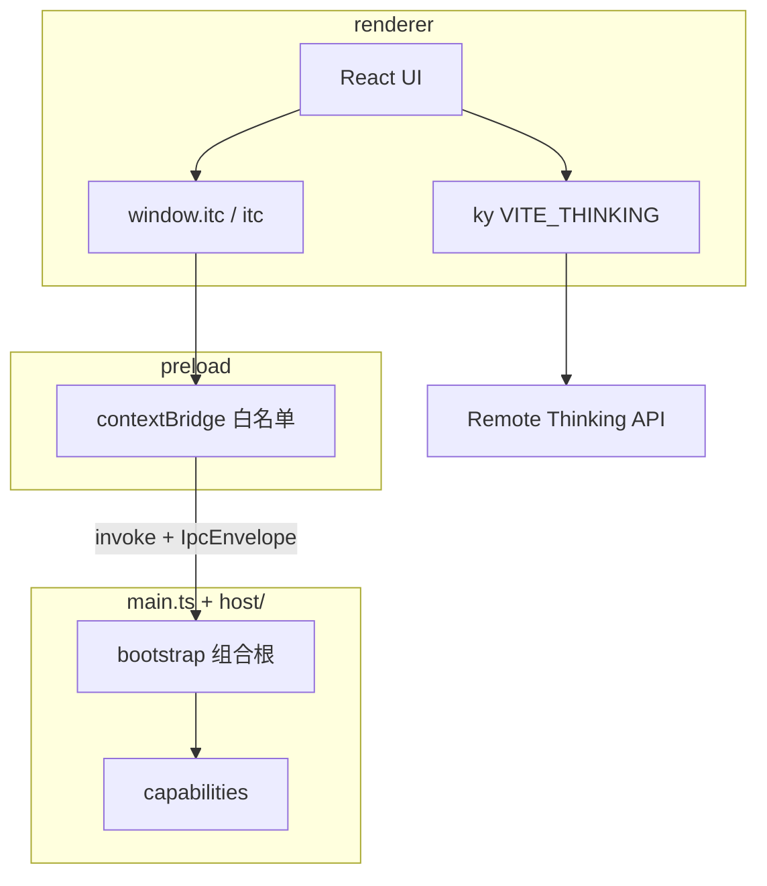

# Studio 架构

> SSOT：Forge 扁平进程入口 + 按角色的宿主层（`src/host/`）；契约独立成层（`src/shared/ipc/`，框架无关）。

## 1. 定位

**i thinking Studio**（`@i-thinking/studio`）是 monorepo 内的 Electron 桌面壳：

| 做                                          | 不做                      |
| ------------------------------------------- | ------------------------- |
| Forge + Vite 多进程桌面应用                 | NestJS 嵌在 Main          |
| host 能力模块 + 薄组合根                    | 跨进程物理 feature 共目录 |
| 契约 IPC（`window.itc` / 全局 `itc`）       | 暴露裸 `ipcRenderer`      |
| 本地能力：store / dialog / SQLite / sidecar | Renderer 任意 SQL         |
| 业务 HTTP → 远程 `VITE_THINKING`            | 本地再起一套 Nest         |

独立后端 `apps/service` 与 Studio **零运行时耦合**。

## 2. 进程与数据流



| 层           | 职责                                                       | 禁止                                            |
| ------------ | ---------------------------------------------------------- | ----------------------------------------------- |
| **host**     | 宿主能力：框架 + IPC 装配 + 能力域实现 + 生命周期          | 依赖 UI（`@/`）                                 |
| **preload**  | `Api` → `ipcRenderer.invoke/on`；只碰 `shared/ipc/` 的契约 | 业务逻辑、`host/**`、让频道字符串外流           |
| **renderer** | UI + 远程 HTTP；全局 `itc`                                 | `electron`、host 实现（可 `import type` `itc`） |
| **forge**    | 打包 / makers / hooks / sidecar stage                      | 业务代码、IPC 契约                              |

## 3. 目录

```text
apps/studio/
├── forge/          # 打包 only
├── sidecar/        # staging 二进制
├── index.html
└── src/
    ├── main.ts       # 薄组合根
    ├── preload.ts    # 纯适配器
    ├── preload.port.ts  # 离线通路端口（竞态队列）
    ├── renderer.tsx
    ├── App.tsx
    ├── shared/ipc/   # 契约：零 electron / node / dom import
    │   ├── channels.ts  spec.ts  specs/  api.ts  error.ts
    ├── host/         # 主进程
    │   ├── framework/     # 插件框架：module / context / logger / paths
    │   ├── ipc/           # IPC 装配：types / register / handlers/
    │   ├── capabilities/  # 能力域实现：sidecar / chat / database / assistant / security …
    │   └── lifecycle/     # 进程生命周期：single-instance
    └── …             # UI（@ → src/）
```

各层的边界含义：

| 层                   | 放什么                         | 判据                                                       |
| -------------------- | ------------------------------ | ---------------------------------------------------------- |
| `shared/ipc/`        | 频道、schema、派生类型、错误码 | 被三端同时打包；`shared-framework-free` 规则强制零框架依赖 |
| `host/framework/`    | 插件机制与主进程基建           | 被能力域引用，自身不引用能力域                             |
| `host/ipc/`          | handler 实现与注册装配         | 频道字符串的唯一来源是契约                                 |
| `host/capabilities/` | 域的服务实现（**不再是插件**） | 被 `host/ipc/handlers` 调用                                |
| `host/lifecycle/`    | 进程级钩子，非插件             | 在 `main.ts` 里直接调用而非注册                            |

ESLint：renderer / preload / host / shared 四条边界规则（`eslint.config.ts`）。

## 4. 对话双通路

| 通路 | 路径                                                                | 要点                                                       |
| ---- | ------------------------------------------------------------------- | ---------------------------------------------------------- |
| 离线 | renderer → `assistant:connect` → MessagePort → main → 本机 provider | 密钥只进主进程（safeStorage），渲染进程不读回              |
| 在线 | renderer → `AssistantChatTransport` → `${VITE_THINKING}/chat`       | service 的 AI SDK 路由；`Authorization` 用渲染进程登录令牌 |

- 两条通路共用同一份历史适配器与会话列表（`@i-thinking/chat`），差别只在 runtime hook：
  离线 `useLocalRuntime` + `ChatModelPort`，在线 `useChatRuntime` + 传输层。
- 通路选择持久化在设置存储 `chat.transport`；切换会换掉 `runtimeHook`，因此 `views/chat` 用
  `key={kind}` 重建运行时（hook 顺序不能跨通路复用）。
- 在线通路可用性 = 配置了 `VITE_THINKING` 且已登录，否则自动回落到离线并在选择器里禁用。
- `/agent` 跑在**独立子窗口**（主窗口 overview 的「打开 Agent 窗口」经 `window:agent.toOpen` 打开），
  不在主窗口内跳路由；两个窗口各有自己的渲染上下文与运行时。

## 5. 组合根与插件

[`main.ts`](../../../apps/studio/src/main.ts) 的顺序：

```ts
const ctx = buildContext(new CorexHost(buildLogger('main')))
const overlayPort = buildOverlayWindowPort()
const chatWindowPort = buildChatWindowPort(ctx)

// ① IPC 注册 —— 必须先于插件循环
const ipc = registerStudioIpc(ctx.ipc, { ctx, overlay: overlayPort, chatWindow: chatWindowPort })

// ② 插件只负责生命周期：security → database → window → sidecar
for (const plugin of plugins) await plugin.register(ctx)

// ③ before-quit：逆序 dispose 插件，再 ipc.dispose()（LIFO，只拆自己注册的）
```

**顺序不可颠倒**：window 插件会 `loadURL`，渲染进程随即 `invoke`。注册晚一拍会让首个
`store:toRead` 失败，而 `/agent` 在 `loaded === false` 时永远渲染 `null` ——
是白屏而不是崩溃。

```ts
interface Plugin {
  name: string
  register: (ctx: Context) => void | Promise<void>
  dispose?: () => void | Promise<void>
}
```

- **插件只做生命周期**：安全会话与 CSP（security）、关库（database）、建窗（window）、
  起停 sidecar（sidecar）。**频道注册已不由插件承担** —— 那是 `host/ipc` 遍历契约的职责
- **注册必须显式**：写在 `main.ts` 的数组里。不用基于 glob 的副作用自动注册 —— 那会破坏
  tree-shaking 与可测性。
- **多窗口**：主窗口与浮层窗口由 window 插件在启动期创建（浮层经 `OverlayWindowPort` 读写）；
  **Agent 子窗口按需创建**，归 `capabilities/agent-window.ts` 的 `AgentWindowPort`，由
  `window:agent.toOpen` 触发。建窗公共原语（路径解析 / 加载 / 安全附着）在
  `capabilities/window-factory.ts` —— 各窗口只写自己的选项，不再各复制一份建窗代码。
- 能力域粒度：小域单文件（`capabilities/window.ts`）；有内部辅助的域用前缀分组
  （`capabilities/assistant.ts` + `assistant-protocol.ts` + `assistant-key.ts`）。
- 单文件超过约 300 行即拆分（`sidecar.ts` 目前 545 行，是本层待拆的已知项）。

## 6. IPC 契约

**完整规范见 [ipc-contract.md](./ipc-contract.md)**（含三条平台约束、错误模型、反模式）。
摘要：

- 单一事实源：[`src/shared/ipc/`](../../../apps/studio/src/shared/ipc/)，零 `electron` / `node` / `dom` 依赖，被三端同时打包
- 频道：`namespace:action`，48 个（46 invoke + 2 push），见 [`channels.ts`](../../../apps/studio/src/shared/ipc/channels.ts)
- **schema-first**：类型由 `z.infer` 从 zod schema 推导（[`specs/`](../../../apps/studio/src/shared/ipc/specs/)），**不另手写 DTO**
- 三处 `satisfies` 闭环：main 的 `Handlers`、preload 的 `Api`、renderer 的 `Window.itc`；
  契约聚合另有四条穷尽性断言，缺一个频道即编译失败
- 错误：信封携带有限 code 联合（[`error.ts`](../../../apps/studio/src/shared/ipc/error.ts)）；
  预期业务失败走 `IpcError`，编程错误走 `IPC_HANDLER_ERROR`
- 暴露名：仅 `window.itc`（全局标识符 `itc`）
- 契约测试：[`src/shared/ipc/contract.test.ts`](../../../apps/studio/src/shared/ipc/contract.test.ts)

## 7. 安全（摘要）

- `contextIsolation: true`、`nodeIntegration: false`、`sandbox: true`
- trusted sender + 允许 origin / `file:`
- 无任意 SQL IPC；无 Renderer 通用 sidecar spawn

## 8. 扩展新域

```text
契约侧（缺一步都编译不过）
1. shared/ipc/channels.ts            加频道常量
2. shared/ipc/specs/<domain>.ts      加 in/out schema（satisfies 该域频道集）
3. shared/ipc/specs/index.ts         并入聚合 —— 穷尽性断言会强制
4. shared/ipc/api.ts                 加 Api 叶子

主进程侧
5. host/ipc/handlers/<domain>.ts     实现 handler 切片
6. host/ipc/index.ts                 并入 buildHandlers

接线
7. preload.ts 的 api 字面量加一行（satisfies Api 会强制）
8. 若该域有生命周期需求：host/capabilities/<domain>.ts 写插件 + main.ts 注册
9. contract.test 绿 + api-reference / examples
```

## 9. 决策

| 决策                              | 理由                                                                  |
| --------------------------------- | --------------------------------------------------------------------- |
| 保留 Forge 扁平进程入口           | `main.ts`/`preload.ts`/`renderer.tsx` 是 Forge 官方模板形态           |
| `host/` 按角色分层                | 原 `plugins/` 单层平铺混了框架/契约/能力/生命周期四种角色             |
| 契约提到 `src/shared/ipc/`        | 它被三端同时打包，挂在「主进程」名下语义不对                          |
| eslint 强制 `shared/**` 框架无关  | 目录名不声明约束，靠规则把不变量变成机器可验                          |
| 能力模块内嵌 host，不取代进程划分 | 注册显式、按域内聚；与 VS Code 的 `contrib/` 是同类思路（非同一形态） |
| 删除 `host/contract/`             | `itc.ts` 手工维护 38 个类型，已由 specs 派生取代                      |
| 删除 `framework/handle.ts`        | 频道注册的唯一来源收敛到 `registerAll`                                |
| 8 个空壳插件整体删除              | 频道注册迁走后它们只剩一行日志；保留的 4 个只做生命周期               |
| 删除 `through.ts`                 | 0 字节空文件                                                          |
| `paths.ts` / Forge CJS            | 打包现实约束                                                          |
