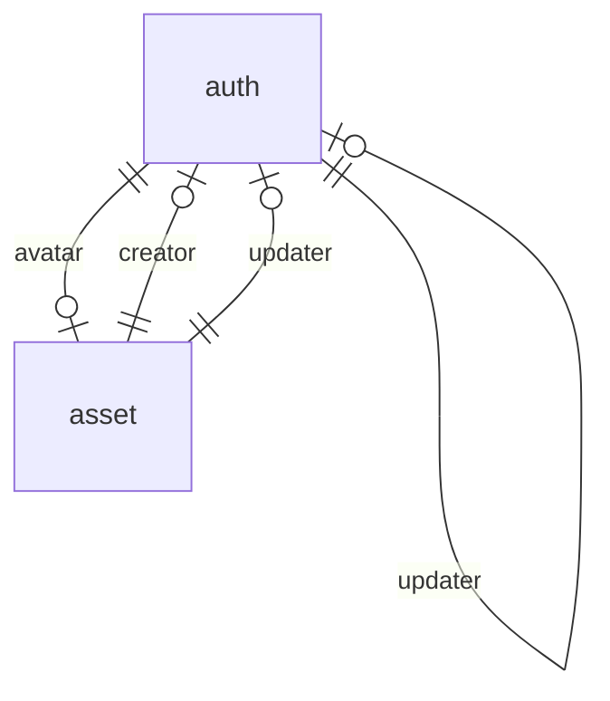
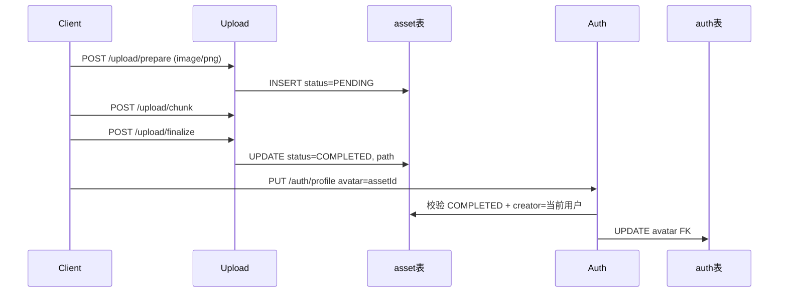

# 数据库表协作

PostgreSQL 业务表采用 **camelCase 列名**（Rust entity 字段仍为 snake_case，通过 `column_name` 映射）。

## ER 关系

| 关系 | 说明 |
|------|------|
| `auth.avatar` → `asset.id` | 用户头像，删除 asset 时 SET NULL |
| `auth.creator/updater` → `auth.id` | 账号审计，自引用 |
| `asset.creator/updater` → `auth.id` | 上传/资源审计 |

## auth 表

Entity：[`entity/src/auth.rs`](../entity/src/auth.rs)

| 列 (DB) | 类型 | 说明 |
|---------|------|------|
| id | uuid PK | 用户 ID |
| username | text UNIQUE | 登录名 |
| password | text | 加密后密码 |
| email | text | 邮箱 |
| phone | text UNIQUE | 手机号（可 NULL，唯一） |
| age | int | 年龄 |
| gender | text | MALE / FEMALE |
| birthday | date | 生日 |
| avatar | uuid FK | → asset.id |
| archivedAt | timestamptz | 归档时间 |
| createdAt | timestamptz | 创建时间 |
| creator | uuid FK | → auth.id |
| updatedAt | timestamptz | 更新时间 |
| updater | uuid FK | → auth.id |
| expiresAt | timestamptz | 过期时间 |

**使用模块**：auth（登录/profile）、user（后台 CRUD）

## asset 表

Entity：[`entity/src/asset.rs`](../entity/src/asset.rs)

| 列 (DB) | 类型 | 说明 |
|---------|------|------|
| id | uuid PK | 资源 ID |
| kind | text | 类型，上传为 `upload` |
| hash | text | 文件 SHA256（64 位 hex），索引 |
| sha | text | 合并后磁盘文件 SHA |
| size | bigint | 文件总字节 |
| mime | text | MIME |
| extension | text | 扩展名 |
| name | text | 文件名 |
| path | text | 磁盘路径（完成后） |
| metadata | text | 扩展元数据 |
| status | text | PENDING / UPLOADING / COMPLETED / FAILED / EXPIRED |
| chunk | int | 分片大小（字节） |
| total | int | 分片总数 |
| chunks | int[] | 已上传分片索引 |
| archivedAt / createdAt / creator / updatedAt / updater / expiresAt | | 审计字段 |

**磁盘协作**（upload 模块）：

| 路径 | 用途 |
|------|------|
| `chunks/{uploadId}/chunk-{n}.part` | 分片临时文件 |
| `uploads/{uploadId}-{filename}` | 合并后成品 |

**使用模块**：upload（分片上传）、auth/user（avatar 联查）

## 审计字段约定

`archivedAt`、`createdAt`、`creator`、`updatedAt`、`updater`、`expiresAt` 在 auth / asset 上语义一致：

- **createdAt / creator**：创建时间与创建者
- **updatedAt / updater**：最后更新
- **archivedAt**：软归档/失败标记
- **expiresAt**：上传任务过期（默认 24h）

## 跨模块流程：头像绑定

## 迁移

- 基线：[`migration/src/000001_20260819.rs`](../migration/src/000001_20260819.rs)
- Profile 字段：[`migration/src/000001_20260819.rs`](../migration/src/000001_20260819.rs)（`auth` 表内 `phone` / `gender` / `birthday` / `avatar`）

详见 [`migration/README.md`](../migration/README.md)。
