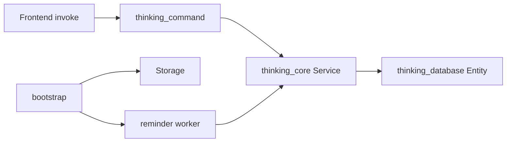

# 02 — 架构：Command / Core / Database

## 分层职责

| Crate / 模块 | 路径 | 职责 |
|--------------|------|------|
| `thinking-command` | `apps/client/src-tauri/crates/command` | 薄 IPC：解析参数、取 `Storage`、调用 Service |
| `thinking-core` | `apps/client/src-tauri/crates/core` | 业务：`toWrite` / `toRead` / `toUpdate` / `toRemove`、调度 `toClaimFire` |
| `thinking-database` | `apps/client/src-tauri/crates/database` | DDL 迁移、Entity / DTO（`*P`）、`Storage` 连接 |
| App bootstrap | `apps/client/src-tauri/src/app` | 打开 DB、跑迁移、`manage(Storage)`、注册 handlers、启动 worker |

**边界**：Command **不写**业务规则；Database **不写**业务规则；校验与事务在 Core。

## 调用链



前端：

```ts
invoke('reminder:read', { params: filter })
```

Rust Command（示例）：

```rust
#[tauri::command(rename = "reminder:write")]
pub async fn reminder_write(
    state: State<'_, Storage>,
    params: WriteP,
) -> CommandResult<Vec<String>> {
    Service::toWrite(state.connection(), params).await
}
```

## Storage

- 类型：`Storage` 持有 `Arc<DatabaseConnection>`
- 路径：`database_path(app_data_dir)` → `{appdata}/i-thinking.db`
- 启动：`initialize` → `migration::run` → `app.manage(db_state)`
- 消费：Command / Worker 通过 `state.connection()` 传入 Service

相关文件：

- [`storage.rs`](../../../apps/client/src-tauri/crates/database/src/storage.rs)
- [`bootstrap.rs`](../../../apps/client/src-tauri/src/app/bootstrap.rs)
- [`handlers.rs`](../../../apps/client/src-tauri/src/app/handlers.rs)

## Reminder Worker

- 文件：[`src/reminder/worker.rs`](../../../apps/client/src-tauri/src/reminder/worker.rs)
- 启动时立刻 `tick_once`，之后约 **12s** 轮询
- 流程：`toReadSchedulable` → `should_fire` → **`toClaimFire`** → 桌面通知 → `emit("reminder:fired", id)`
- 前端 **不要** 再自行触发同等响铃逻辑，避免双通道

语义细节见 [05-reminder-calendar.md](./05-reminder-calendar.md)。

## 模块清单（command crate）

当前 `thinking_command` 导出：`asset`、`calendar`、`countdown`、`magnetic_tile`、`mirror`、`reminder`。

另有 app 本地 command（如 `overlay:*`、`screenshot:*`），不在本 crate，本文不展开。
