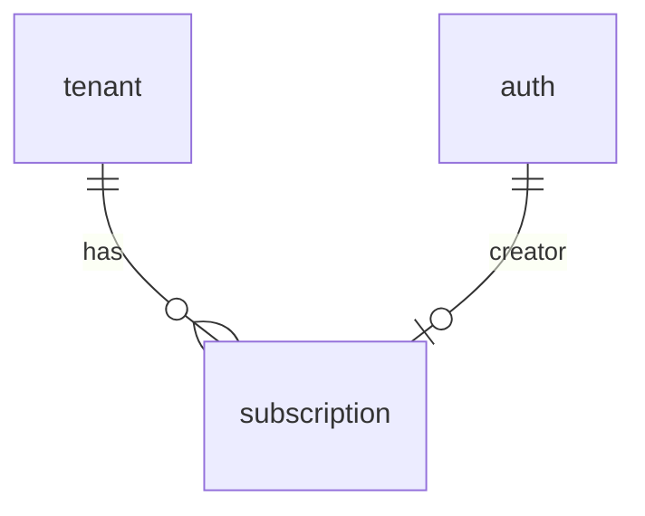

# Subscription

路由前缀：`/api/v1/tenants/{id}/subscriptions`

## 概述

个人租户的**付费档位（订阅）**管理。本模块只负责「某租户此刻生效的是哪个档位」，**不存配额数字**——档位对应的日 token 配额由配置 `gateway.plan_daily_token_quota` 提供，实际扣减由 [`gateway`](../gateway/README.md) 模块完成。

| 能力        | 说明                                                                                       |
| ----------- | ------------------------------------------------------------------------------------------ |
| 开通 / 续订 | 事务内：旧订阅标 `EXPIRED`/`CANCELED`（未过期的 `expiresAt` 截断到当前时间），再插入新订阅 |
| 列表        | 返回订阅历史（含已取消 / 已到期），按创建时间倒序                                          |
| 取消        | 立即失效：状态置 CANCELED，`expiresAt` 截断到当前时间                                      |
| 当前配额    | 返回生效配额及其来源（`PLAN` / `FREE` / `GLOBAL`）                                         |
| 生效判定    | `effective_quota()` 供聊天热路径调用，带 60s Redis 缓存                                    |

## 与同域其他模块的区别

- [`tenant`](../tenant/README.md)：只管租户与成员（`tenant.type` 区分 PERSONAL / TEAM），不知道订阅的存在。
- `subscription`（本模块）：只管**个人租户的档位与有效期**。团队租户不可订阅，走全局配额。
- [`gateway`](../gateway/README.md)：消费本模块的 `effective_quota()` 决定日配额，并做 Redis 日窗计数。

三者的配额优先级见 [`guide/configuration.md`](../../../guide/configuration.md#模型网关配额)。

## 路由一览

| 方法   | 路径                                                  | 鉴权              | 说明                          |
| ------ | ----------------------------------------------------- | ----------------- | ----------------------------- |
| GET    | `/api/v1/tenants/{id}/subscriptions`                  | JWT + 租户成员    | 订阅历史（含已取消 / 已到期） |
| POST   | `/api/v1/tenants/{id}/subscriptions`                  | JWT + OWNER/ADMIN | 开通 / 续订                   |
| DELETE | `/api/v1/tenants/{id}/subscriptions/{subscriptionID}` | JWT + OWNER/ADMIN | 取消订阅（立即失效）          |
| GET    | `/api/v1/tenants/{id}/quota`                          | JWT + 租户成员    | 当前生效配额及来源            |

## 鉴权说明

- 中间件 `Auth::isRequired()` 挂在整个 scope 上，未登录直接 401 类。
- 列表要求调用者是该租户 **ACTIVE 成员**；开通与取消要求租户内角色为 **OWNER / ADMIN**（`TenantRole::can_manage`）。
- 平台 ADMIN（`Claims::role().is_admin()`）走 `TenantService::require_role` 的旁路，视为租户 ADMIN。
- 非成员返回 `300006`（权限不足），未登录返回 `300001`。

## 数据表

Entity：[`entity/src/subscription.rs`](../../../entity/src/subscription.rs)（表 `subscription`）

| 列 (DB)                                    | 类型        | 说明                                                   |
| ------------------------------------------ | ----------- | ------------------------------------------------------ |
| id                                         | uuid PK     | 订阅 ID                                                |
| tenantID                                   | uuid FK     | → `tenant.id`，CASCADE，索引 `idx_subscription_tenant` |
| plan                                       | text        | 档位名，必须存在于 `gateway.plan_daily_token_quota`    |
| status                                     | text        | ACTIVE / CANCELED / EXPIRED，默认 ACTIVE               |
| expiresAt                                  | timestamptz | 到期时间，**NULL = 永久有效**                          |
| createdAt                                  | timestamptz | 订阅创建时间；**创建即生效**，故也是生效开始时间       |
| archivedAt / creator / updatedAt / updater |             | 审计字段                                               |

本模块另**读取** `tenant.type`（PERSONAL / TEAM）用于「仅个人租户可订阅」的校验。

## 表协作



| 关系                                       | 说明                         |
| ------------------------------------------ | ---------------------------- |
| `subscription.tenantID` → `tenant.id`      | 订阅归属，删除租户时 CASCADE |
| `subscription.creator/updater` → `auth.id` | 订阅审计                     |

**索引**：`idx_subscription_tenant`（`tenantID`）＋ 部分唯一索引 `uidx_subscription_active`：

```sql
CREATE UNIQUE INDEX uidx_subscription_active
  ON subscription ("tenantID") WHERE status = 'ACTIVE';
```

**生效判定**：`status = ACTIVE` 且 `archivedAt IS NULL` 且（`expiresAt IS NULL` 或 `expiresAt > now`）。
订阅**创建即生效**（`createdAt` 就是生效时间），因此不存在「已创建但未开始」的状态。
同一租户同一时刻**最多一条 ACTIVE 订阅**（上面那条部分唯一索引在 DB 层兜底，并发写入会被拒）。

**续订语义**：旧未结束订阅的 `expiresAt` 会被**截断到当前时间**（永久订阅亦如此）——新订阅即刻接管，不浪费剩余天数。

**过期标记**：订阅不靠定时任务。`list` 时顺带把已过 `expiresAt` 的 ACTIVE 行标为 `EXPIRED`；配额判定本身只看时间，不依赖该状态。

**取舍**：不支持「预约未来生效」与「补录历史开始时间」；若产品需要，须重新引入独立的 `startAt`。

## 实现架构

```
SubscriptionModule::configure            # src/services/subscription/module.rs
  ├── scope("/tenants/{id}/subscriptions")  .wrap(Auth::isRequired())
  │     ├── GET    ""                        → SubscriptionController::toList
  │     ├── POST   ""                        → SubscriptionController::toWrite
  │     └── DELETE "/{subscriptionID}"       → SubscriptionController::toRemove
  └── scope("/tenants/{id}/quota")           .wrap(Auth::isRequired())
        └── GET    ""                        → SubscriptionController::quota
              └── SubscriptionService        # src/services/subscription/service.rs
                    ├── require_member / require_manage
                    │     └── TenantService::require_role   # 跨模块复用（tenant 拥有该领域）
                    ├── subscribe       → 作废旧 ACTIVE 订阅 + 插入新订阅（事务）
                    ├── list            → 按 createdAt 倒序（顺带惰性标 EXPIRED）
                    ├── cancel          → status=CANCELED，expiresAt 截断
                    ├── quota           → 当前生效配额（接口用）
                    ├── effective_quota → 租户级配额（订阅档位 > 免费档 / 全局兜底）
                    └── active_plan(db, redis, tenantID) -> Option<String>   # 60s Redis 缓存
                          └── 被 effective_quota 及 gateway 复用
```

配额解析链路（在 `gateway` 侧）：

```
gateway_model.dailyTokenQuota > 0 ? 取值
  : 租户为 PERSONAL ?
      SubscriptionService::active_plan() = Some(plan)
        ? gateway.plan_daily_token_quota[plan]  (未知档位 → 免费档)
        : gateway.free_daily_token_quota
  : gateway.daily_token_quota
```

## 接口详情

### POST 开通 / 续订

```http
POST /api/v1/tenants/{id}/subscriptions
Authorization: Bearer {token}
Content-Type: application/json

{
  "plan": "PRO",
  "expiresAt": null
}
```

| 字段      | 类型   | 必填 | 说明                                                 |
| --------- | ------ | ---- | ---------------------------------------------------- |
| plan      | string | 是   | 档位名，须存在于 `gateway.plan_daily_token_quota`    |
| expiresAt | number | 否   | 毫秒时间戳；缺省或 `null` 为永久有效，须晚于当前时间 |

```json
{
  "code": 200000,
  "success": true,
  "msg": "创建成功",
  "data": {
    "id": "9f1c…",
    "tenantID": "3ab7…",
    "plan": "PRO",
    "status": "ACTIVE",
    "expiresAt": null,
    "createdAt": 1789803327000,
    "updatedAt": 1789803327000
  },
  "timestamp": 1789803327000
}
```

重复调用即**续订**：旧订阅被置为 CANCELED 且 `expiresAt` 截断到当前时间，新订阅即刻生效。

### GET 订阅历史

返回 `data` 为订阅数组（含已取消 / 已到期），按 `createdAt` 倒序。

### DELETE 取消订阅

```http
DELETE /api/v1/tenants/{id}/subscriptions/{subscriptionID}
Authorization: Bearer {token}
```

成功返回 `data: null`，`msg: 取消订阅成功`。取消后该租户配额**立即**回落免费档。

### GET 当前生效配额

```http
GET /api/v1/tenants/{id}/quota
Authorization: Bearer {token}
```

```json
{
  "code": 200000,
  "success": true,
  "msg": "获取当前配额成功",
  "data": {
    "tenantID": "3ab7…",
    "type": "PERSONAL",
    "source": "PLAN",
    "plan": "PRO",
    "dailyTokenQuota": 5000000
  },
  "timestamp": 1789803327000
}
```

`source`：`PLAN`（生效订阅档位）/ `FREE`（个人租户免费档）/ `GLOBAL`（团队租户或无租户身份）。
单模型可用 `gateway_model.dailyTokenQuota` 另行覆盖该值。

## 错误码

| code   | 场景                                                                             |
| ------ | -------------------------------------------------------------------------------- |
| 200003 | 档位不存在或未配置配额、时间戳无效、`expiresAt` 不晚于当前时间、团队租户试图订阅 |
| 300001 | 未登录                                                                           |
| 300006 | 非租户成员，或租户内角色非 OWNER/ADMIN                                           |
| 400001 | 租户或订阅不存在（含订阅不属于该租户）                                           |
| 400002 | 并发订阅冲突（部分唯一索引拒绝，重试即可）                                       |
| 600001 | 数据库错误                                                                       |
